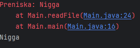

# Iznimke
Iznimke su u `Javi` predstavljene klasama koje izravno ili neizravno nasljeduju klasu 
`java.lang.Thowable`.

Uzmimo za primjer sljedeci error:

Navedeni opis prestavlja stazu stoga (stack trace) i ukljucuje:
- Naziv iznimke: `java.lang.ArithmeticException`
- Opisnu poruku uz iznimku: `/ by zero`
- Lokacija poziva programskog koda s iznimkom: `at dijeljenje.BezObradeIznimke.podijeli(BezObradeIznimke.java)`

## Obrada iznimaka
- obavaljamo ju koristenjem blokova `try` i `catch`
- Blok `try` sadrzava programski kod u koje postoji mogucnost bacanja iznimke i izvodi se
sve do trenutka kad se baci iznimka i nakon toga se pocne izvoditi kod u `catchu`
- Blok `catch` sadrzava programski kod koji se izvodi u slucaju kad se odredena iznimka dogodi

## Finally blok
Blok `finally` se postavlja nakon `catch` bloka i izvodi se **uvijek**, bez obzira je li
doslo do iznimke ili ne. ``` try { … };catch { … }; finally { … };```. Koristi se u slucaju
da je nakon `try` bloka potrebno obaviti radnje poput zatvaranja datoteke ili veze s bazom 
podataka.

## Hijerarhija iznimaka u Javi


## Oznacene i neoznacene iznimke
Klase iznimaka koje izravno ili neizravno nasljeduju klase `RuntimeException` i `Error` spadaju u skupinu
**neoznacenih** iznimaka. Klase koje izravno ili neizravno nasljeduju klasu `Exception`
spadaju u skupinu **oznacenih** iznimaka.

Neoznacene iznimke se ne moraju obradivati, dok isto to ne vrijedi za oznacene iznimke.

## Primjer _custom_ klase za iznimke
```java

public class MyException extends Exception {
    public MyException() {
        super("Dogodila se pogreška u radu programa!");
    }
    public MyException(String message) {
        super(message);
    }
    public MyException(String message, Throwable cause) {
        super(message, cause);
    }
    public MyException(Throwable cause) {
        super(cause);
    }
}
```
## LogBack datoteke
Cesto se informacije o iznimkama zapisuju u `log` datoteke. Biblioteka `LogBack` se
konfigurira koristenjem XML datoteke koja se mora nalaziti unutar projekta.

Primjer te `xml` datoteke izgleda ovako:
```˙xml
<?xml version="1.0" encoding="UTF-8"?>
<configuration>
    <appender name="FILE" class="ch.qos.logback.core.FileAppender">
        <file>logs/pogreske.log</file>
        <encoder>
            <pattern>%date %level [%thread] %logger{10} [%file:%line] %msg%n</pattern>
        </encoder>
    </appender>
    <root level="debug">
        <appender-ref ref="FILE" />
    </root>
</configuration>
```
LogBack omogucava kreiranja nekoliko razina log zapisa u ovisnosti o njihovoj vaznosti i
detaljnosti:
- ERROR
- WARN
- INFO
- DEBUG
- TRACE

Primjer `logger` implementacije:
```java
  private static final Logger logger = LoggerFactory.getLogger(Main.class);
    logger.error("Unijeli ste ime kategorije koja vec postoji molimo pokusajte ponovno");
```
## Ispis staze stoga iznimke
- Staza stoga iznimke (`stack trace`) sadrzava kljucne informacije o razlogu bacanja neke
iznimke i cesto se ispisuje u konzolu razvojnog okruzenja
- Ispis staze stoga u konzolu moguce je obaviti i pozivom metode `printStackTrace` iz
objekta koji predstavlja iznimku, a najcesce se koristi unutar `catch` bloka
 
### Primjer koristenja `printStackTrace` metode:
```java
public class Main {
    public static void main(String[] args) {
        try{
            readFile("myFile.txt");
        }catch (Preniska e){
            e.printStackTrace();
            System.out.println(e.getMessage());
        }

    }
    private static void readFile(String fileName)  {
            throw new Preniska("Nigga");
    }
}
```
Ispis gornjeg koda:


