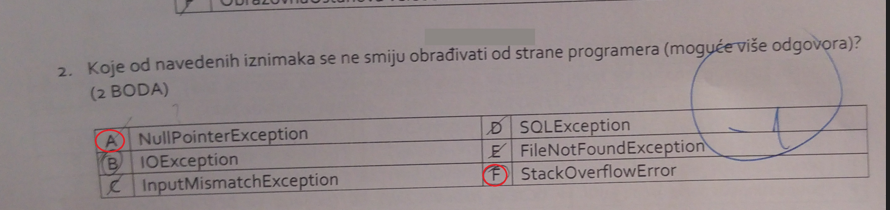
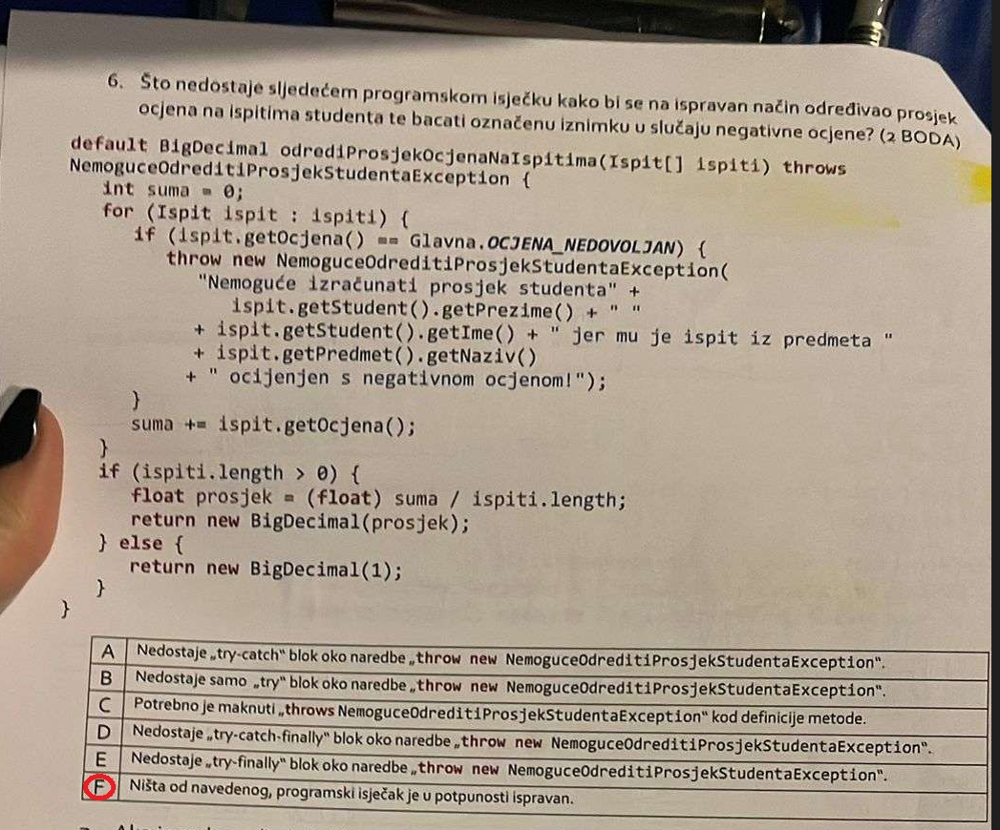
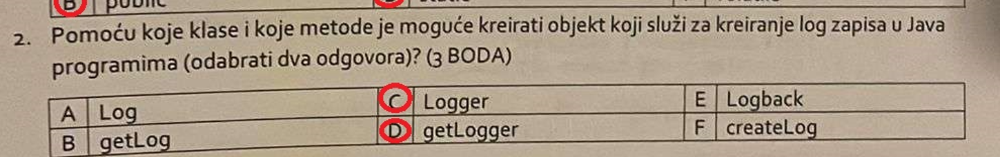
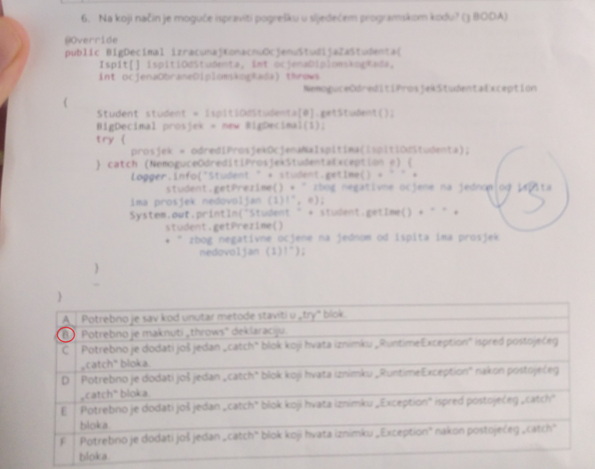
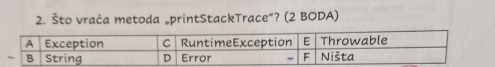
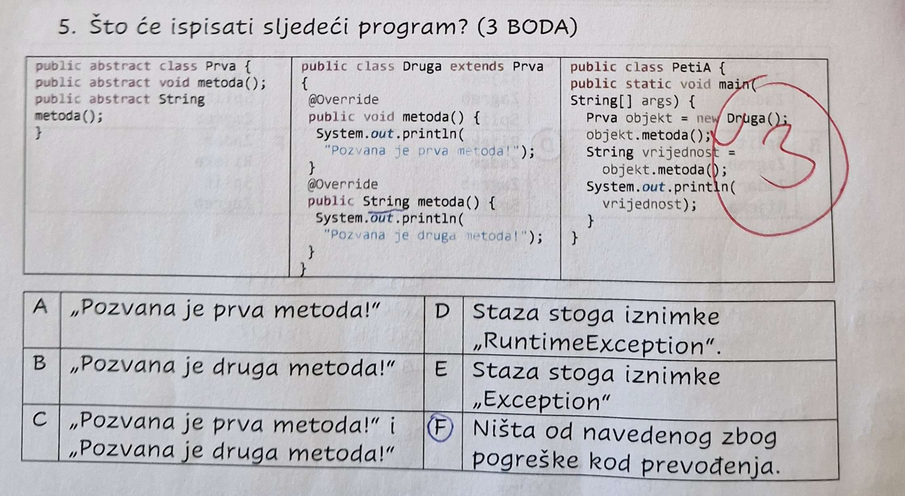
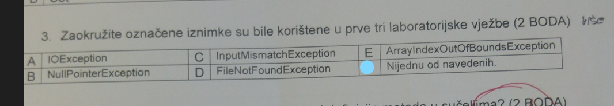
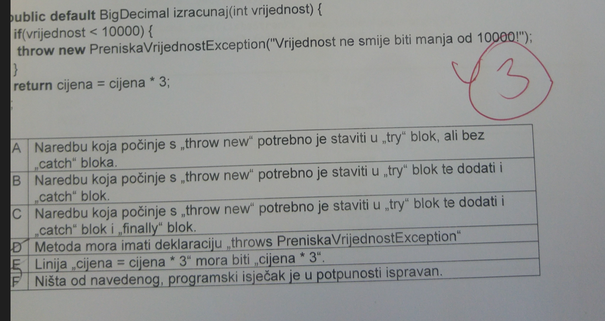
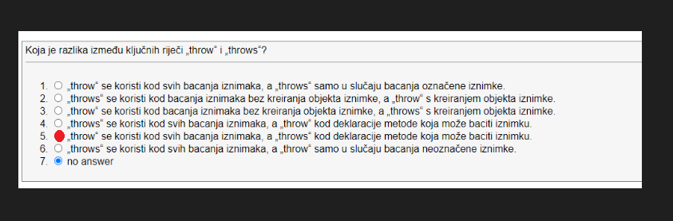

# Iznimke pitanja sa kolokvija

1. pitanje


Odgovor: F, zato sto `StackOverflowError` nasljeduje `Error` klasu koja sa ne smije ni pod kojim slucajem obradivati. Sad nisam siguran za `NullPointerException` je li to po Radovanu odgovor ali prema mome nije jer se on smije i mora obradivati.

2. pitanje



Odgovor: F, kod je u potpunosti ispravan nema potrebe za ovim nekim stvarima koje je on naveo kao odgovore.

3. pitanje



Odgovor: C i D. Ovdje nema nista posebno za objasniti klasa koja se koristi za logiranje iznimaka je `Logger`, a metoda koja to omogucava je `getLogger`.

Primjer:
```java
private static final Logger logger = LoggerFactory.getLogger(Glavna.class);
```

4. pitanje:



Odgovor: B. Ovdje se bas ne vidi najbolje kod, ali ono sto ja vidim je da u nekoj metodi koristimo throws i u istoj metodi radimo try-catch te iznimke sto stvarno nema smisla.

5. pitanje:



Odgovor: F. Pericin ovo najbolje zna da ta metoda ne vraca nista vec samo ispisuje neki String o iznimci.

6. pitanje



Odgovor: F. Ovdje se nista ne dogada zato sto smo deklarirali metodu koja bi trebala vratiti String, a nismo ga vratili unutar tijela metode. Ovo je oznacena iznimka pa se program nece ni prevesti kako treba.

7. pitanje:



Odgovor: C. Po mome sijecanju koristili smo InputMismatchException, ali ovako
pitanje je najbolje ne odgovoriti jer ko zna sto Radovan misli.

8. pitanje



Odgovor: F

8. pitanje:



Odgovor: 5