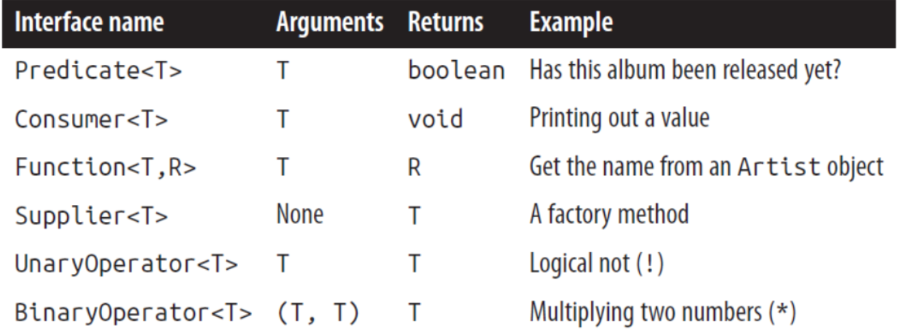

# Lambda izrazi u Javi
Lamdba izrazi su korisni jer se odredeni kod moze smanjiti i olaksati nam posao.

Primjer jednostavnog koristenja lambde za filtriranje, mapiranje i trazenje max ocjene studenata
odredene godine:
```java
List <Student> students;
double highScore = students.stream()
        .filter(Student s -> s.getGradYear()==2011)
        .map(Studen s -> s,getScore())
        .max();
```
Sintaksa lambda izraza:


## Funkcionalna sucelja


## Funkcionalno sucelje `Predicate`
- `Predicate` predstavlja `Boolean` vrijednost funkcije s jednim argumentom
- Primjer :
```java
Studen s -> s.graduationYear()==2011
```

## Funkcionalno sucelje `Consumer<T>`
- Operacija koja prima jednu vrijednost i ne vraca rezultat
- Omogucava ulancavanje funkcija koristenjem naredbe `andThen(Consumer after)`
- Primjer: 
```java
String s -> System.out.println(s);
(k,v) -> System.out.println("key: "+ k + ", value:" +v);
```
## Funkcionalno sucelje `Function<T>`
- Prima jedan argument i vraca rezultat
- Moze primati i vracati razlicite tipove parametara
- Omogucava koristenje statickih metoda za ulancavanje `compose` i `andThen`
- Primjer:
```java
Student s -> s.getName()
```
## Funkcionalno sucelje `UnaryOperator<T>`
- Specijalni obli `Function` sucelja
- Prima jedan paramater i vraca isti tip paramtera
- Primjer
```java
String s - > s.toLowerCase();
```
## Funkcionalno sucelje `BinaryOperator<T>`
- Specijalni oblik `Function` sucelja
- Prima dva paramtera i vraca isti tip paramtera
-Primjer:
```java
(String, String y)->{
    if(x.length() > y.length())
        return x;
    return y;
}
```
## Vrijednosti u lambda izrazima
- Parametri lambda funkcija se ponasaju kao da imaju `final` modifikatorž
- **Effectively final** izraz podrazumijeva da se varijabli samo jednom moze dodijeliti
vrijednost ako se koristi u lambda izrazu

## Tokovi
`Stream pipeline` se sastoji od tri elementa:
- Izvora
- Nula ili vise `intermediate` operacija
- `Terminal` operacije

- Metoda `stream` vraca sucelje tipa `Stream` koje sadrzi metode za obavljanje kompleksnih
operacija nad zbirkama koristenje interne iteracije
- `lazy` operacije se ne izvrasavaju odmah dok se `eager` operacije izvrsavaju odmah
- Osnovna razlika između „lazy” i „eager” operacija je u tome sto one vracaju: ako metoda vraca „Stream”, onda je „lazy”, a ako ne vraca
  ništa, onda je „eager”

## Optional
- Predstavlja novi tip podatka koji predstavlja bolju alternativu od `null` vrijednosti
- Optional je zapravo samo neka kutija koja moze i ne mora sadrzavati nas objekt
- Ako vrijednost naseg objekt nije `null` onda se nalazi u kutiji zvanoj `Optional` inace
je obrnuto

## Refernece za metode
- Omogucavaju ponovno iskoristavanja metoda kao lambda izraza:
```java
FileFilter x = File f->f.canRead();
FileFilter x = File::canRead();
```

### Primjer jednostavnih lamda izraza
```java
()-> System.out.println("Hello Lambda");
x->x+10;
(int x, int y)->{return x+y;};
(String x, String y)-> x.length() - y.length();
(String x)->{
    listA.add(x);
    listB.remove(x);
    return listB.size();
}
```

## Najcesce operacije s tokovima
- `collect(Collectors.toList())`
  - Sluzi za generiranje liste iz vrijednosti unutar `Streama`
  - Spada u **eager** operacije
- `map`
  - Mapira jednu skupinu vrijednosti u drugu
  - Npr. moguce je pretvoriti sve `String` vrijednosti u _uppercase_ vrijednosti:
```java
List<String> collected = Stream.of("a", "b", "hello")
.map(string -> string.toUpperCase())
.collect(Collectors.toList());
```
- `filter`
  - Sluzi za filtriranje vrijednosti prema zadanim vrijednostima
  NPR:
```java
List<String> beginningWithNumbers
  = Stream.of("a", "1abc", "abc1")
    .filter(value -> isDigit(value.charAt(0)))
    .collect(Collectors.toList());
```
- `min` i `max`
  - Pronalaze najmanju i najvecu vrijednost 
- `reduce`
  - Koristi se kad je iz zbirke vrijednosti potrebno odrediti jednu vrijednost
  - Npr. sumu elemenata je moguce izracunati na sljedeci nacin:
```java
int count = Stream.of(1, 2, 3)
.reduce(0, (acc, element) -> acc + element);
```
- `flatMap`
  - Koristi se u slucaju potrebe zamjenom elemenata u toku i njihovo konkateniranje 
u zajednicku zbirku. Npr sumu elemenata je moguce izracunati na sljedeci nacin:
```java
List<Integer> together = Stream.of(asList(1, 2), asList(3, 4))
  .flatMap(numbers -> numbers.stream())
  .collect(Collectors.toList());
  assertEquals(asList(1, 2, 3, 4), together)
```
## Koristenje paralelizma
- Kako bi se maksimalno iskoristila snaga visejezgrenog procesora kod obradivanja podataka
unutar zbirki, moguce je koristiti _paralelne tokove_
- Razlika izmedu _serijskih_ i _paralelnih_ tokova ocituje se samo u pozivu metode 
`parallelStream` umjesto `stream`

