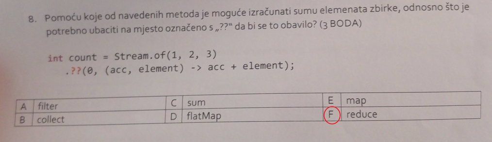

# Pitanja sa kolokvija

1. pitanje:

Odgovor: B.

2. pitanje:

Odgovor: A. `flatMap` se koristi npr. ako imamo Listu Lista koje sadze stringove. `flatMap` nam omogucava da to stopimo u samo jednu listu. Mozemo zamisliti kao da 2d niz pretvorimo u 1d niz.

3. pitanje:

Odgovor: F. `reduce` se koristi se kad je iz zbirke vrijednosti potrebno odrediti jednu vrijednost

4. pitanje:

Odgovor: C (stream pipeline)

5. pitanje:

Odgovor: Ovo ne znam jos treba potvrditi

6. pitanje:

Odgovor: C i D. `findAny` vraca Optional tip objekta i kada imamo optional objekt trebamo koristiti `get` metodu kako bi mogli dohvatiti tu vrijednost unutar `Optional` kontejnera.

7. pitanje:

Odgovor: Predicate