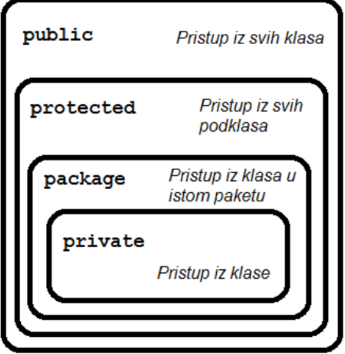

# MODIFIKATORI

We can divide `modifiers` into two groups:
- Access modifiers
- Non - Access modifiers

## Access modifiers
<table>
<tr>
<td>
    Modifier
</td>
<td> Description</td>
</tr>
<tr>
<td>public</td>
<td>The class is accessible by any other class</td>
</tr>
<tr>
<td>default</td>
<td> The class is only accessible by the classess in the same package. This is used
when you don't specify a modifier
</td>
</tr>
<tr>
<td>private</td>
<td>The code is only accessible within the declared class</td>
</tr>
<tr>
<td>protected</td>
<td>The code is accessible in the same package and subclasses</td>
</tr>
</table>

## Non-Access modifiers
For classes you can either use `final` or `abstract`
<table>
<tr>
<td>
    Modifier
</td>
<td> Description</td>
</tr>
<tr>
<td>final</td>
<td>The class cannot be intherited by other classes</td>
</tr>
<tr>
<td>abstract</td>
<td> The class cannot be used to create objects (To access an abstract class, it must
be inherited from another class)

</table>

For attributes and methods you can use one of the following:
<table>
<tr>
<td>
    Modifier
</td>
<td> Description</td>
</tr>
<tr>
<td>final</td>
<td>Attributes and methods cannot be overridden/modified</td>
</tr>
<tr>
<td>static</td>
<td> Attributes and methods belongs to the class, rather than an object. They can be called
without creatin an object
</td>
</tr>
<tr>
<td>abstract</td>
<td>Can only be use in an abstract class, and can only be used on methods. The method
doesm't have a body. The body is provided by the subclass (inherited from)</td>
</tr>
<tr>
<td>transient</td>
<td>Attributes and methods are skipped when serializing the object containing them</td>
</tr>
<tr>
    <td>synchronized</td>
    <td>Methods can only be accessed by one thread at a time</td>
</tr>
<tr>
<td>volatile</td>
<td>The value of an attribute is not cached thread-locally, and is always read from the "main memory"</td>
</tr>
</table>

Image representation of modifiers in java:

## Zadaci iz kolokvija

1. Ako je potrebno definirati konstantnu vrijednost u Javi koja ce se moci koristiti u svim
klasama koje sve modifikatore je potrebno koristiti u tom slucaju: `public`,`static`, `final`
2. Ako je potrebno definirati vrijednost koja se moze koristiti u svim klasama, da se radi o
vrijednosti koja se nalazi samo na jednom mjestu u memoriji te kojoj se vrijednost ne moze
mijenjati, koje sve modifikatore morate koristiti. `public`,`static`, `final`
3. Koje sve modifikatore je moguce koristiti kod definicija metoda u suceljima: `public`,
`private`,`default`,`static`.
4. Ako je potrebno definirati konstantu vrijednost u javi koja ce se moci korsititi samo u paketu u kojem se nalazi koje sve modifikatore je potrebno koristiti u tom slucaju:
`static` i `final`.
=> AKO SE NE NAVEDE NIJEDAN MODIFIKATOR PODRAZUMIJEVANI JE PACKAGE PRIVATE KOJI OMOGUCAVA
PRISTUP CLANOVIMA KLASE SAMO AKO SU KLASE U ISTOM PAKETU

