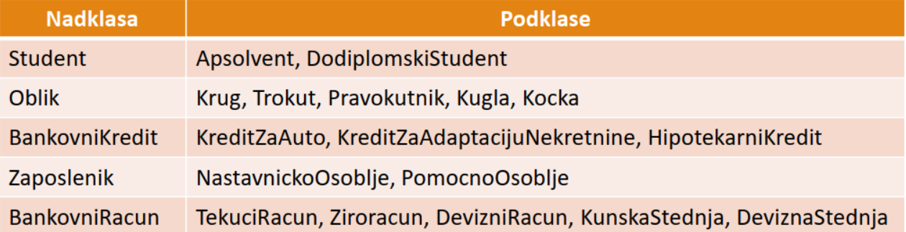
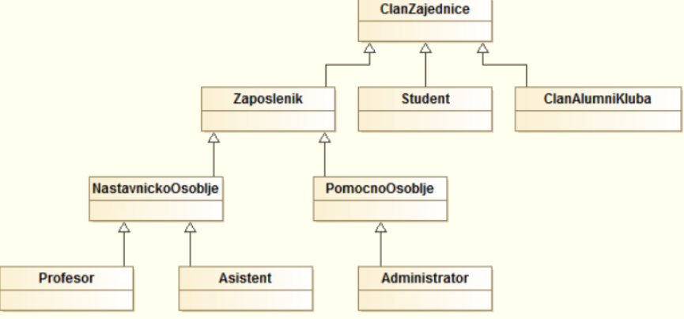
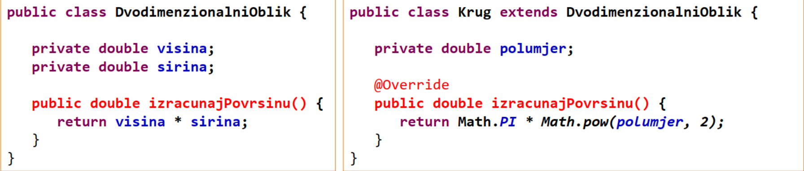
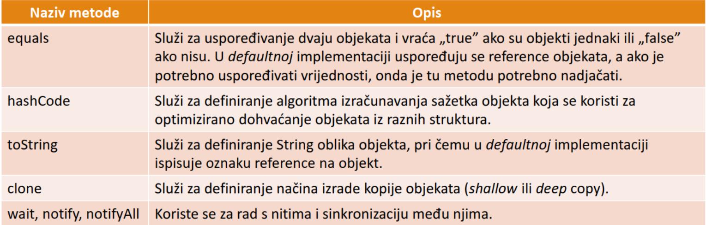
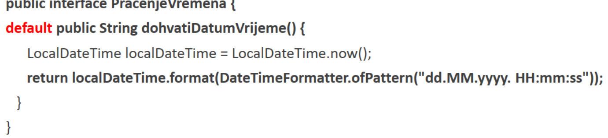
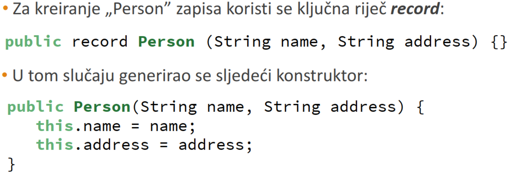
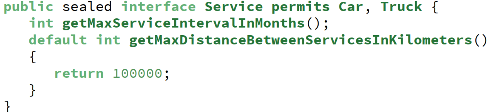

# Nasljedivanje
Kod nasljedivanja imamo dvije vrste klasa **nadklasa(superclass)** i **podklasa(subclass)**.
U podklasu se dodaju nove clanske varijable i metode i predstavlja konkretniju implementaciju
od svoje **nadklase**, pri cemu moze mijenjati ponasanje svoje **nadklase**. U _Javi_ postoji
klasa `java.lang.Object` koju izravno (kao prvu **nadklasu**) ili neizravno implicitno 
nasljeduju sve klase u _Javi_. _Java_ podrzava samo jednostruko nasljedivanje klasa odnosno
jedna klasa moze nasljediti samo jednu klasu za razliku od `C++`.

Pogledajmo sada sljedece primjere nasljedivanja:

Jedna nadklasa moze imati vise podklasa dok jedna podklasa moze imati samo jednu nadklasu

Odnosi klasa cesto se prikazuju **UML DIJAGRAMOM**:


## Kljucna rijec `super`
Ako iz neke **podklase** pokusavamo dohvatiti clanove i metode **nadklase** koristiti cemo
kljucnu rijec `super`. Ona predstavlja referencu na **nadklasu**, dok kljucna rijec `this`
predstavlja referencu na trenutnu klasu. Takoder pomocu `super` se dohvaca konstruktor **nadklase**,
 odnosno tek nakon poziva konstruktora **nadklase** se izvrsavaju sve ostale naredbe unutar
konstruktora **podklase**. Ako se ne navede takav raspored naredbi `compiler` javlja gresku.

## Nadjacavanje metoda u podklasama:

Primjer: 

„@Override” označava nadjačavanje metoda, u slučaju neispravnog nadjačavanja se javlja pogreška

## Klasa Object
Klasa `Object` sadrzava niz metoda koje se cesto nadjacavaju kako bi se definiralo novo
ponasanje klase:




## Polimorfizam
- Omogucava opcenito programiranje umjesto specificnog programiranja
- Odnosno ako imamo **nadklasu** koja sadrzava metodu mi tu metodu mozemo nadjacati u **podklasi**
- Drugim rijecima mozemo castati odnosno koristi metode iz **podklase** pomocu **nadklase** ako **nadklasu**
`castamo` u **podklasu**
- 
Evo primjera:
```java
import java.util.ArrayList;
import java.util.Random;
import java.util.Scanner;

public class Main {
    public static void main(String[] args) {
        Scanner scanner =  new Scanner(System.in);
        Animal animal;
        int choice = Scanner.nextInt();
        if(choice==1){
                animal = new Dog();
                animal.speak();//bark
        }else if(choice==2){
            animal = new Cat();
            animal.speak();//meow
        }
    }
}
```
Objekt **podklase** moze se tretirati kao objekt kalse ako se nad njim izvrsi `cast` operacija
i u tom slucaju moze koristi samo metode iz **nadklase**:
```java
Trokut trokut = new Trokut();
((Oblik)trokut).metodaIzKlaseOblik();
```

## Apstraktne klase i metode
- Apstraktne klase nisu predivdene da se iz njih kreiraju objekti, vec su namijenjene za 
nasljedivanje u drugim klasa
- Objekte iz takvih klasa nije moguce kreirati jer se radi o nedovrsenim klasa
- Oznacavaju se kljucnom rijecju `abstract`
- Ako klasa ima barem jednu apstraktnu metodu, automatski mora biti apstraktna inace `compiler`
javlja gresku
- Apstraktne kalse mogu sadrzavati i vlastiti konstruktor koji se poziva unutar konstruktora
**podklase**

Primjer:
```java
abstract class Animal {
  // Abstract method (does not have a body)
  public abstract void animalSound();
  // Regular method
  public void sleep() {
    System.out.println("Zzz");
  }
}

// Subclass (inherit from Animal)
class Pig extends Animal {
  public void animalSound() {
    // The body of animalSound() is provided here
    System.out.println("The pig says: wee wee");
  }
}

class Main {
  public static void main(String[] args) {
    Pig myPig = new Pig(); // Create a Pig object
    myPig.animalSound();
    myPig.sleep();
  }
}
```
## Kljucna rijec `final`
Kako bi sprijecili daljnje nasljedivanje neke klase potrebno je koristiti kljucnu rijec
`final` npr.

```java
public final class Krug extends DvodimenzionalniOblik
```
Isto vrijedi i za metode, kako bi sprijecili daljnje nadjavavanje neke metode potrebno je koristiti
kljucnu rijeci `final`. npr.
```java
public final double izracunajOpsegKruga();
```
Metode koje su oznacene modifikatorom `private` ne mogu se pozvati izvan klase u kojoj se
nalaze, pa su samim time implicitno oznacene modifikatorom `final`.

Kljucnom rijecju `final` oznacavaju se i konstantne vrijednosti. npr:
```java
public static final String NAZIV_DRZAVE = "Hrvatska";
```

## Sucelja u Javi
Sucelje je jos jedan od nacina postizanja **apstrakcije** u Javi. `interface` je potpuno
**apstraktna** klasa koja se koristi kako bi grupirali povezane **metode** sa praznim tijelima.
Sucelja opisuju koje sve operacije se trebaju moci obavljati, ali ne sadrze nuzno i njihovo
implementaciju. Sucelja osim metoda mogu sadrzavati i konstantne vrijednost, a svi clanovi
sucelja moraju biti `public`.

Primjer:
```java
public interface Elektricno{
    void ukljuci();
}
```
- U slucaju da klasa ne implementira sve metode iz sucelja, klasa mora biti **apstraktna**

## Prosirenja funckcionalnosti sucelja u JAVI 8
- Od Jave 8 sucelja mogu sadrzavati i **podrazumijevane implementacije** metoda koja se
oznacavaju kljucnom rijecju `default`.
Primjer:

- Takoder je omoguceno koristenje i statickih metoda unutar sucelja
- Svako sucelje koje sadrzi samo jednu apstraktnu metodu naziva se **funkcionalnim suceljem**
- Moguće je napisati vlastita funkcionalna sučelja ili koristiti neka koja već postoje u Javi (npr.
  „Comparator”, „ActionListener”, „Runnable” ili slično

## Prosirenja funckcionalnosti sucelja u JAVI 9
- U Javi 9 unutar sucelja je omoguceno kreiranje i privatnih metoda

## Prosirenja funkctionalnosti sucelja u Javi 14
- `Record` omogucuje definiranje tipova podataka koji su nepromjenjivi i namjena im je cuvanje
podataka
Npr:

## Prosirenja funkctionalnosti sucelja u Javi 17
- Zapecacena (saeled) sucelja i klase omogucavaju definiranje koje klase se mogu implementirati
ili nasljedivati
npr:

- Isto kao i kod sucelja moguce je zapecatiti i klase