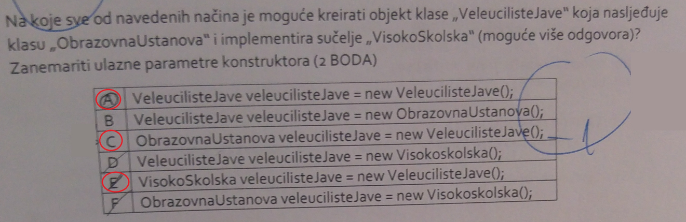
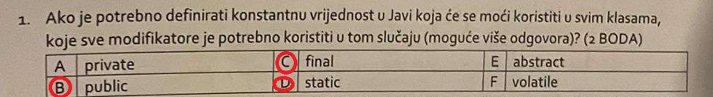
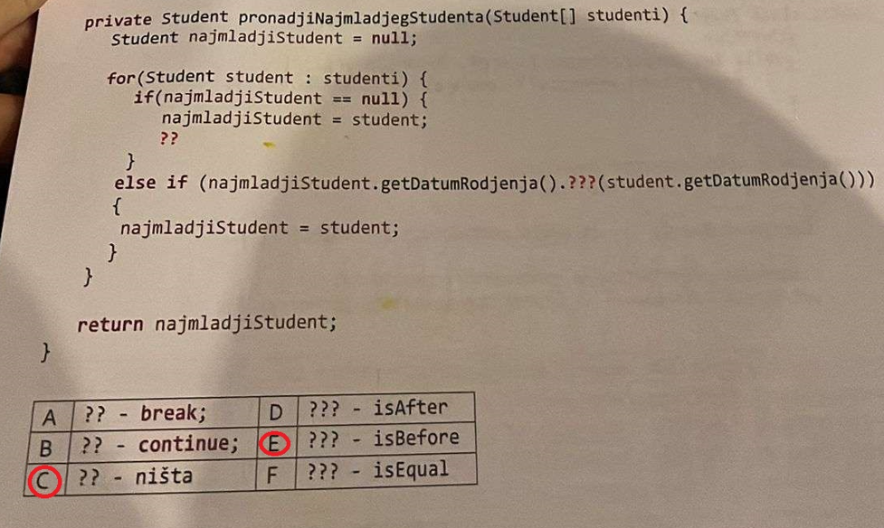
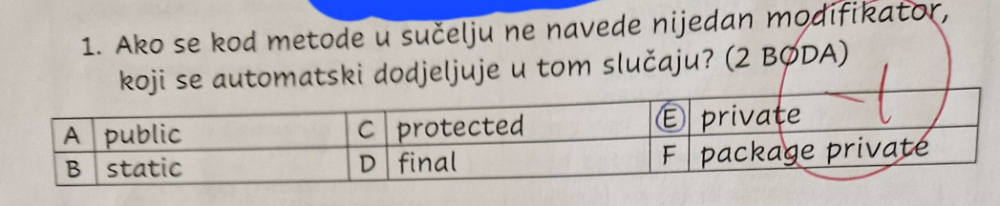
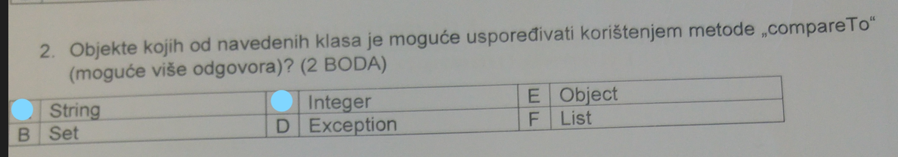
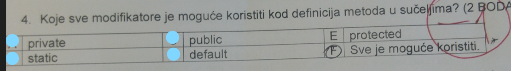
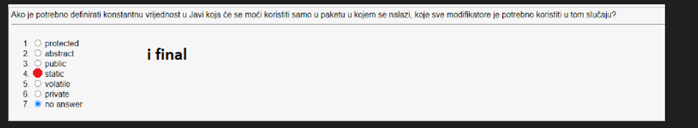

# Pitanja iz kolokvija

1. Pitanje:

Odgovor: A,C,E.

Objasnjenje: Ako zelimo kreirati objekt nekog
tipa koji nasljeduje neku klasu ili implementira neko sucelje mozemo iskoristiti svojstvo polimorfizma. Odnosno mozemo kreirati objekt pomocu nadklase sa time da se korisiti poziv konstruktor podklase npr.
```java
class Nadklasa{

}
interface Sucelje{

}
class PodKlasa extends Nadklasa implements Sucelje{

}

public class Main {
    public static void main(String[] args) throws IOException {
            PodKlasa podKlasa = new PodKlasa(); // klasicno kreiranje objekta
            Nadklasa podklasa1 = new PodKlasa(); // kreiranje objekta pomocu nadklase i podklase koristenjem polimorfizma
            Sucelje podklasa2 = new PodKlasa(); // kreiranje objekta pomocu sucelja i podklase koristenjem polimorfizma

    }
}
```
2. pitanje


Odgovor: B,C,D

Objasnjenje: Posto moramo koristiti vrijednost u svim klasama
odabrati cemo public i static modifikatore. Kako vrijednost mora biti neporomjenjiva takoder cemo koristiti i final modifikator.

3. pitanje



Odgovor: C, i E

Objasnjenje: Ovo je kao tipican max i min samo sa OOP-om.
Jedino treba paziti na isBefore i isAfter.

4.pitanje

Odgovor: A

Objasnjenje: Kako se radi o sucelju, a ne klasi automatski
se dodjeljuje modifikator `public`, on se cak i podrazumijeva u sucelju pa ti intelisense kaze da je nepotreban implicitno ga pisati. Ako bi se radilo o klasi onda se automatski dodjeluje modifikator `package-private`.

5.pitanje

Odgovor: A i C.

Objasnjenje: Klase koje imaju metodu `compareTo` su: String, Integer, Double, Float, BigDecimal, Date, BigInteger, Calendar, Enum. Ne mijesati metode `compare`,`compareTo` i `equals`.

6. pitanje



Odgovor: A,B,C,D

Objasnjenje: U javi 8 su dodani `default` i `static`, a u Javi 9 `private`.

7. pitanje



Odgovor: Static i final. Takoder se ovdje podrazumijeva da ako
se ne koristi nikoji modifikator poput `public` ili `private` da se automatski pridruzuje `package-private` koji omogucuje pristup samo iz paketa
