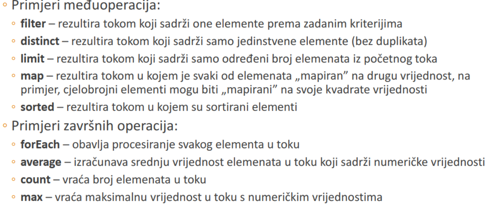
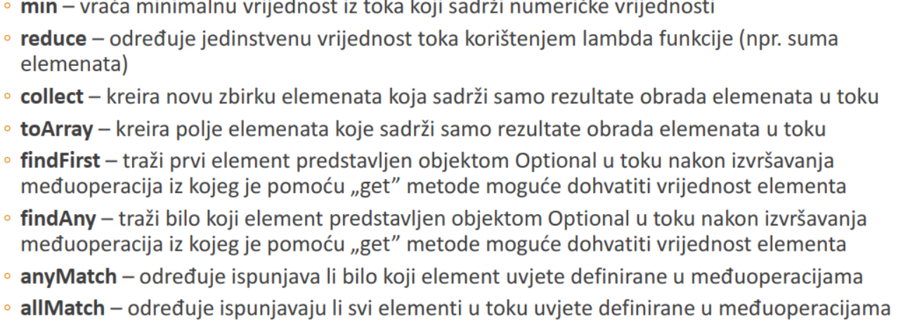

# Zbirke
Zbirke (`Collection`) predstavljaju podatkovnu strukturu u obliku objekta koji moze 
sadrzavati reference drugih objekata.

Neka od sucelja koja definiraju najcesce koristene zbirke su:
- `Collection` => osnovno sucelje iz kojeg su _nasljedene_ zbirke `Set` i `List`
- `Set` => sucelje zbirki koje ne moze sadrzavati duplikate
- `List` => sucelje zbirke koja moze sadrzavati duplikate i cuva poredak elemenata
- `Map`=> sucelje zbirke koja pohranjuje parove **kljuc-vrijednost**, te ne nasljeduje sucelje
`Collection`

## Liste
- Poredana zbirka koja moze sadrzavati vise referenci istog objekta
- Najcesce koristene implementacije su:
  - `ArrayList` 
  - `LinkedList`
  - `Vector`
- Klasa `LinkedList` ima bolje performanse kod umetanja elemenata usred liste dok ima 
losije performanse kod prelazenja elemenata

### Primjer `ArrayList` implementacije:
```java
    String[] poljeStringova = {"PROLJEĆE", "LJETO", "JESEN", "ZIMA", "ZIMA"};
    List<String> listaStringova = new ArrayList<>();
//f
    for(String doba : poljeStringova) {
        listaStringova.add(doba);
    }
    Iterator<String> iterator = listaStringova.iterator();
    while(iterator.hasNext()) {
        System.out.println(iterator.next());
    }
```

### Primjer `LinkedList` implementacije:
```java
String[] poljeStringova = {"PROLJEĆE", "LJETO", "JESEN", "ZIMA", "ZIMA"};
List<String> listaStringova = new LinkedList<>();
for(String doba : poljeStringova) {
    listaStringova.add(doba);
}
for(String doba : listaStringova) {
    System.out.println(doba);
}
System.out.println();
String pop = ((LinkedList<String>)listaStringova).pop();
System.out.println(pop); //PROLJECE
String prvi = ((LinkedList<String>)listaStringova).getFirst();
System.out.println(prvi);//LJETO
```
## Metode iz klase `Collections`
<table>
<tr>
<th>Ime metode</th>
<th>Opis metode</th>
</tr>
<tr>
<td>sort</td>
<td>sortira elemente liste</td>
</tr>
<tr>
<td>binarySearch</td>
<td> koristi algoritam binarnog pretraživanja zbirke kod traženja određenog elementa</td>
</tr>
<tr>
<td>reverse</td>
<td>obrnuto sortira elemente u listi</td>
</tr>
<tr>
<td>shuffle</td>
<td>miješa elemente prema slučajnom redoslijedu</td>
</tr>
<tr>
<td>fill</td>
<td>popunjava zbirku</td>
</tr>
<tr>
<td>copy</td>
<td>kopira element jedne zbirke u drugu</td>
</tr>
<tr>
<td>min</td>
<td>vraca najmanji element iz zbirke</td>
</tr>
<tr>
<td>max</td>
<td>vraca najveci element iz zbirke</td>
</tr>
<tr>
<td>addAll</td>
<td>dodaje elemente iz jedne zbirke u drugu</td>
</tr>
<tr>
<td>frequency</td>
<td>odreduje koliko se puta odredeni element pojavljuje u zbirci</td>
</tr>
<tr>
<td>disjoint</td>
<td>provjerava sadrze li dvije zbirke iste brojeve</td>
</tr>
</table>

### Primjer koristenja `sort` metode:
```java
String[] poljeStringova = {"PROLJEĆE", "LJETO", "JESEN", "ZIMA", "ZIMA"};
List<String> listaStringova = Arrays.asList(poljeStringova);
System.out.println(listaStringova);
Collections.sort(listaStringova);
System.out.println(listaStringova);
int broj = Collections.frequency(listaStringova, "LJETO");
System.out.println(broj);
/*Ispis:
[PROLJEĆE, LJETO, JESEN, ZIMA, ZIMA]
[JESEN, LJETO, PROLJEĆE, ZIMA, ZIMA]
1*/

```

## Setovi
Set je zbirka koja ne cuva poredak elemenata i sadrzava samo po jednu referencu odredenog objekta. Umetanje
elementa koji vec postoji zamjenjuje stari element iz `set`-a. Postoje dvije implementacije `set`-a, a to
su `HashSet` i `TreeSet`. Jedina razlika izmedu toga dvoje je da `TreeSet` moze u konstruktor primiti
**custom** klasu koja moze sluziti za sortiranje elemenata.

### Primjer koristenja `HashSet` implementacije
```java
String[] poljeStringova = {"PROLJEĆE", "LJETO", "JESEN", "ZIMA", "ZIMA"};
Set<String> setStringova = new HashSet<>();
for(String doba : poljeStringova) {
    setStringova.add(doba);
}
for(String doba : setStringova) {
    System.out.println(doba);
}
```

## Mape
Mape su zbirke koje povezuju kljuceve sa vrijednostima. Kljucevi moraju biti jedinstveni, a vrijednosti ne
moraju.
Neke od implementacije `map` su:
- `Hashtable` => koristi se za rad sa nitima, ne moze sadrzavati vrijednost `null` i sporije su
- `HashMap` => moze sadrzavati jednu `null` vrijednost za kljuc i za pripadajucu vrijednost i brze su
- `TreeMap` => koristi strukturu stabla te u konstruktor moze primiti **custom** klasu za sortiranje

### Primjer `HashMap` implementacije:
```java
Map<Integer, Integer> mapaUnesenihBrojeva = new HashMap<>();
Scanner unos = new Scanner(System.in);
for(int i = 0; i < 10; i++) {
    System.out.print("Unesite broj: ");
    Integer broj = unos.nextInt();
    if(mapaUnesenihBrojeva.containsKey(broj)) {
      Integer kolicina = mapaUnesenihBrojeva.get(broj);
      kolicina += 1;
      mapaUnesenihBrojeva.put(broj, kolicina);
    }
    else {
        mapaUnesenihBrojeva.put(broj, 1);
    }
}
System.out.println(mapaUnesenihBrojeva);
unos.close();
/*Unos:
Unesite broj: 8
Unesite broj: 9
Unesite broj: 6
Unesite broj: 5
Unesite broj: 5
Unesite broj: 6
Unesite broj: 6
Unesite broj: 3
Unesite broj: 2
Unesite broj: 1
Ispis:
{1=1, 2=1, 3=1, 5=2,
6=3, 8=1, 9=1*/
```
Kod `HashMapa` je vazno istaknuti da postoji metoda `keySet` koja iz mape dohvaca set kljuceva koji je 
moguce iskoristiti za dohvat svih elemenata iz mape
```java
for(Integer key : mapaUnesenihBrojeva.keySet()) {
    System.out.println(key + " " + mapaUnesenihBrojeva.get(key));
}
```
## Enumeracije
Enumeracije je tip podatka koja sadrzi pobrojani niz konstanti. To su referetni tipovi koji moogu imati
konstruktor i varijable.
- Implicitno su oznacene modifikatorima `final` i `static`
- Nije moguce kreirati objekt koji predstavlja enumeraciju, vec je moguce koristit samo predefinirane 
vrijednosti

### Primjer koristenja enumeracije:
```java
public enum StatusObrade {
  USPJESNA_OBRADA(1, "Uspješno obrađene sve transakcije"),
  TIMEOUT(2, "Neuspješna obrada, isteklo maksimalno vrijeme trajanja"),
  NEISPRAVNI_PODACI(3, "Neuspješna obrada, neispravni podaci u transakcijama");
  private Integer kod;
  private String opis;
  private StatusObrade(Integer kod, String opis) {
    this.kod = kod;
    this.opis = opis;
  }
//getter metode za kod i opis
}
```
```java
for(GodisnjeDoba godisnjeDoba : GodisnjeDoba.values()) {
    System.out.println(godisnjeDoba);
}
StatusObrade status = StatusObrade.USPJESNA_OBRADA;
switch(status) {
    case USPJESNA_OBRADA:
System.out.println("Poruka1");
    break;
case TIMEOUT:
    System.out.println("Poruka2");
    break;
case NEISPRAVNI_PODACI:
    System.out.println("Poruka3");
    break;
}
```
## Tokovi u Java SE 8
- Uvodi se koncept tokova (Stream) koji su slicni iteratorima za manipuliranje elementima u zbirci
- Svaka zbirka ili polje ima mogućnost pozivanja metode „stream” i nad dobivenim tokom obavljati operacije

Neke od metoda koje se korite sa `stream`:


### Primjer koristenja `IntStream` operacija:
```java
int[] brojevi = {8, 10, 4, 9, 5, 7, 1, 3};
System.out.print("Početne vrijednosti: ");
IntStream.of(brojevi)
.forEach(vrijednost -> System.out.print(vrijednost + " "));
System.out.println();
System.out.print("Broj elemenata: ");
System.out.print(IntStream.of(brojevi).count());

System.out.println();
System.out.print("Najveći element: ");
System.out.print(IntStream.of(brojevi).max().getAsInt());
System.out.println();
System.out.print("Suma elemenata: ");
System.out.print(IntStream.of(brojevi).reduce(0, (x, y) -> x + y));
System.out.println();
System.out.print("Sortirani parni brojevi: ");
IntStream.of(brojevi).filter(vrijednost -> vrijednost % 2 == 0)
        .sorted()
        .forEach(vrijednost -> System.out.print(vrijednost + " "));
        /*Ispis:
        Početne vrijednosti: 8 10 4 9
        5 7 1 3
        Broj elemenata: 8
        Najveći element: 10
        Suma elemenata: 47
        Sortirani parni brojevi: 4 8 10*/
```
Vise o `Stream` api ce biti receno u sljedecoj lekciji.

## Nove funkcionalnosti sa zbirkama u Javi 9
- U javi 9 su uvedene nove mogucnosti kreiranja `immutable` listi (liste koje se ne mogu
mijenjati) pomocu `of` metode. Primjer:
```java
List<String> immutableList = List.of("Prvi","Drugi","Treci");
```
- Nakon kreiranja liste nakdnadne promjene njenog sadrzaja rezultiraju bacanje iznimke
`UnsupportedOperationException`
- Na slican nacin je moguce kreirati i mapu
- Nad `streamovima` je moguce i koristiti metodu `takWhile` za ispis samo onih vrijednosti
koje ispunjavaju zadani uvjet. Primjer
```java
Stream.of(1,2,3,4,5,6,7,8,9,10).takeWhile(i-> i<5).forEach(System.out::println);
```
- Na slican nacin se koristi i `dropWhile` metoda za ispis samo onih vrijednosti koje ne 
ispunjavaju zadani uvjet

## Sucelje `Comparator`
- Koristi se za definiranje kriterija sortiranja
- Sadrzi samo jednu **apstraktnu** metodu `compare` koja prima dva objekta i definira 
njihov odnos koji se koristi kod soritranja.
- Posto ima samo jednu **apstraktnu** metodu sucelje `Comparator` je ujedno i funkcionalno
sucelje pa se koristi i u lambda izrazima
### Primjer implementacije sucelja `Comparator`
```java
public class Student {
  private String prezime;
  private String ime;
  private String jmbag;
  private double prosjek;
  //izostavljene "getter" metode i konstruktor
  @Override
  public String toString() {
        return prezime + " " + ime + "(" + prosjek + ")";
    }
}
```
```java
public class ProsjekSorter implements Comparator<Student> {
@Override
  public int compare(Student st1, Student st2) {
  if(st1.getProsjek() > st2.getProsjek()) {
      return 1;
  }
  else if (st1.getProsjek() < st2.getProsjek()) {
      return -1;
  }
    else {
        return 0;
    }
  }
}
```
```java
Student prvi = new Student("Perić", "Pero", "0240293832", 4.11);
Student drugi = new Student("Ivić", "Ivo", "0240212322", 3.82);
Student treci = new Student("Markić", "Marko", "0240297890", 4.78);
Student cetvrti = new Student("Horvat", "Ivan", "0240294345", 3.05);
List<Student> listaStudenata = new ArrayList<>();
listaStudenata.add(prvi);
listaStudenata.add(drugi);
listaStudenata.add(treci);
listaStudenata.add(cetvrti);
Collections.sort(listaStudenata, new ProsjekSorter());
System.out.println(listaStudenata); 
/*Ispis:
[Horvat Ivan(3.05), Ivić Ivo(3.82), Perić
Pero(4.11), Markić Marko(4.78)]*/
```

## Primjer sortiranja liste po vise kriterija

```java
Student prvi = new Student("Perić", "Pero", "0240293832", 4.11);
Student drugi = new Student("Ivić", "Ivo", "0240212322", 4.11);
Student treci = new Student("Markić", "Marko", "0240297890", 4.11);
Student cetvrti = new Student("Horvat", "Ivan", "0240294345", 4.11);
List<Student> listaStudenata = new ArrayList<Student>();
listaStudenata.add(prvi);listaStudenata.add(drugi);listaStudenata.add(treci);
listaStudenata.add(cetvrti);
Function<Student, Double> poProsjeku = Student::getProsjek;
Function<Student, String> poPrezimenu = Student::getPrezime;
Comparator<Student> poProsjekuIPrezimenu =
Comparator.comparing(poProsjeku).thenComparing(poPrezimenu);
listaStudenata.stream().sorted(poProsjekuIPrezimenu).forEach(System.out::println);

/*
Ispis
Horvat Ivan(4.11)
Ivić Ivo(4.11)
Markić Marko(4.11)
Perić Pero(4.11)
 */
```
Objasnjenje koda:

Ovdje koristimo sucelje `Function` koje predstavlja funkciju koja prima jedan argument,
 a vraca rezulatat (prosjek ili JMBAG studenta). FUnction objekte je potrebno iskoristit
unutar `Comparator` metoda `comparing` i `thenComparing`. Dobiveni komparator objekt moze
se iskoristiti u metodi `sorted` kako bi se sortirali elementi po zadanim kriterijima i
na kraju ispisali pomocu metode `forEach` i koristenjem funkcije `System.out::println`.