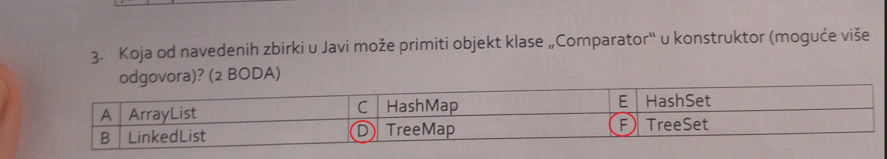
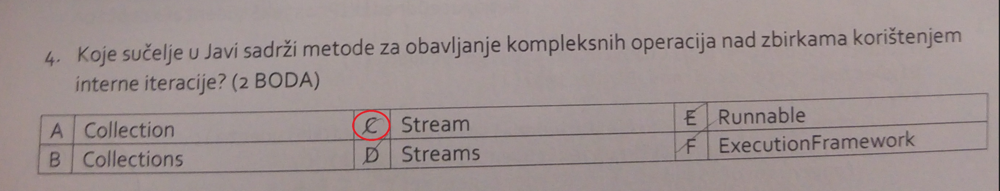
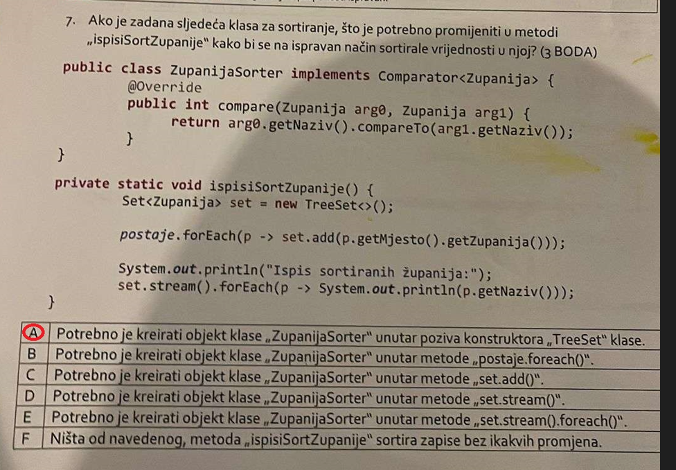
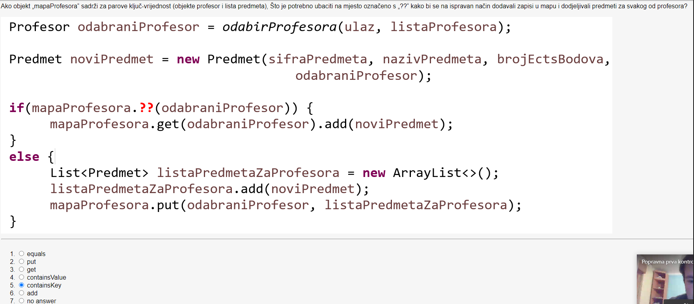
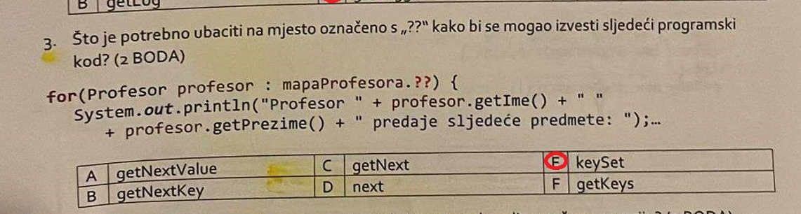

# Zadaci iz kolokvija
1. pitanje:

Odgovor: D i F. `TreeMap` implementira sucelje `SortedMap`, a `TreeSet` implementira sucelje `SortedSet`.

2. pitanje:

Odgovor: C

3. pitanje:

Odgovor: A. Zato sto nije nikako definirano kako cemo zvati ZupanijaSorter

4. pitanje:

Odgovor: 5

5. pitanje:

Odgovor: E. KeySet vraca set kljuceva koje je moguce iskoristi za iteraciju.