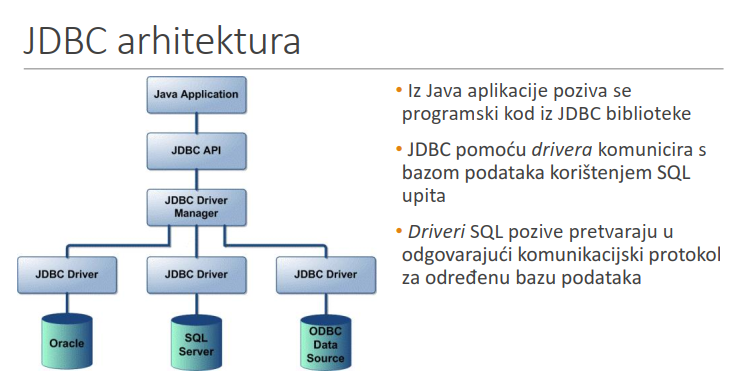
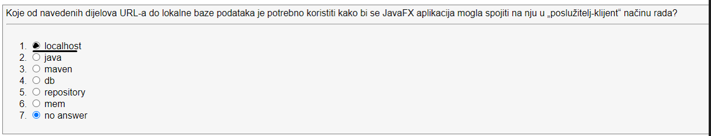
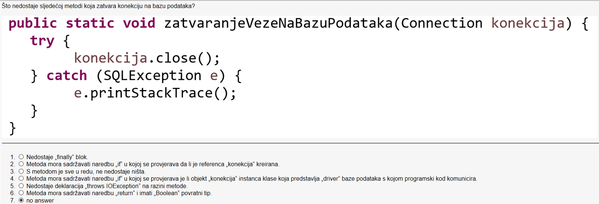
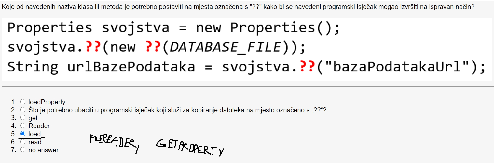
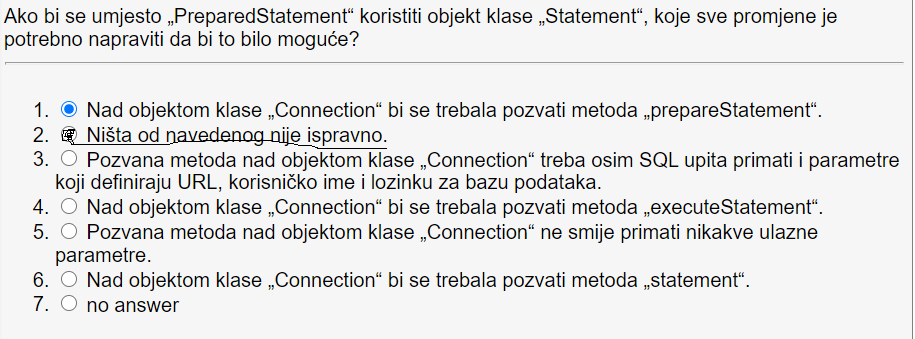
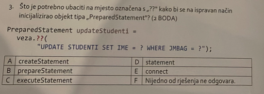
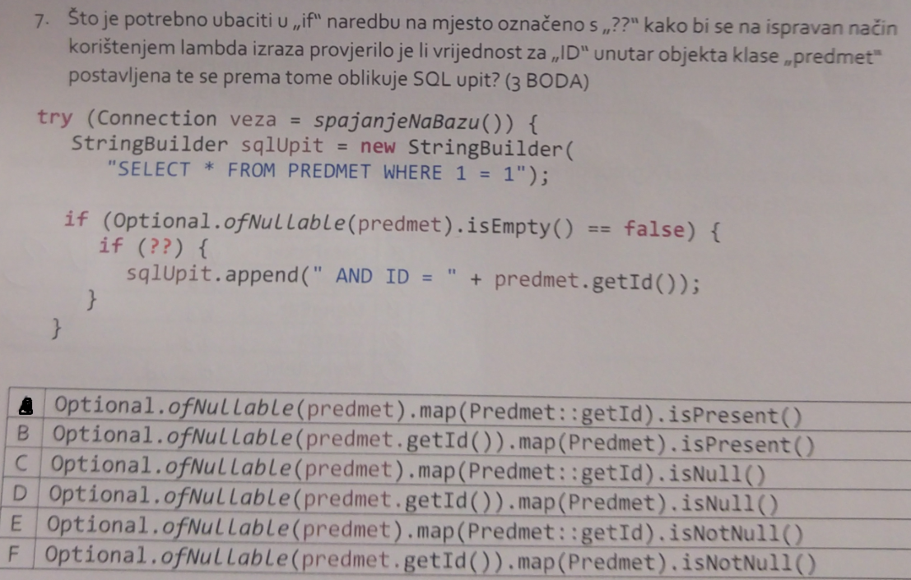
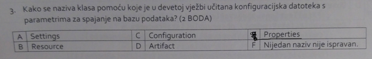
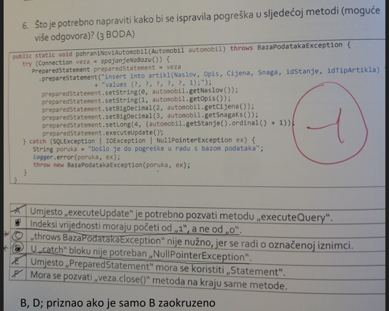

# Baze
- Relacijske baze podataka predstavljaju organizirane zbrike podataka
- Za rad s bazom podataka koristi se SQL (Structured Query Language)
- Najcesce koristene baze podataka su Microsoft SQL, Oracle, Sybase, IBM DB2,
Inofrmix, PostgreSQL, MySQL, Apache Derby i H2
## JDBC
- Za pristup relacijskim bazama podataka JAVA SE sadrzi JDBC
- JDBC (Java Database Connectivity) omogucava spajanje Java aplikacija
na sve vrste baza podataka uz koristenje odgovarajuceg JDBC drivera (u obliku
JAR datoteke)
- Omogućava tri programske aktivnosti:
  - Ostvarivanje veze s izvorom podataka (engl. data source) – bazom podataka
  - Pripremanje i izvršavanje SQL upita (engl. queries) koje uključuju spremanje,
  dohvaćanje, ažuriranje i brisanje podataka iz baze
  - Zatvaranje veze s izvorom podataka



## H2 baza
- H2 je open source relacijska baza u cijelosti implementirana u Javi
- Jednostavna za koristenje
- Podrzava e,bedded i klijent server nacin rada

## Spajanje na bazu
- Prvi korak u pisanju Java programskog koda koji pristupa bazi podataka je
  kreiranje objekta koji predstavlja vezu s bazom podataka:
```java
try {
    Connection veza = DriverManager.getConnection(
    "jdbc:mojDriver:mojaBaza", "mojLogin", "mojaLozinka");
} catch (SQLException e) {
    e.printStackTrace();
}
```
- Objasnjenje:
 - Staticka metoda getConnection iz klase DriverManager sluzi za kreiranje
    Connection objekta i prima parametre koji definiraju URL baze podataka korisnicko ime i lozinku za pristupanje bazi
   - Podaci za spajanje na H2 bazu podataka mogu biti sljedeci:
     - URL: jdbc:h2:tcp://localhost/~/Java-2023
     - Korisničko ime: student
     - Lozinka: student
   - URL koji označava bazu podataka sastoji se od sljedećih dijelova:
       - „jdbc:h2” – označava tip baze podataka
       - „tcp://localhost/~/” – lokacija baze podataka
       - „Java-2021” – naziv baze podataka

## Priprema i izvrsavanje upita
- Da bi se kreirao upit nad bazom podataka mora se koristi objekt tipa Statement
koji omogucava pozivanje metode executeQuery koja izvrsava upit nad bazom podataka i prikuplja rezultate upita
- Objekt tipa ResultSet sadrzi strukturu podataka koja opisuje rezultat izvodenja upita
nad bazom podataka koji se moze sastojati i od vise zapisa redaka
- Pomocu while petlje mozemo napisati kod koji se dohvatiti i ispisati proizvoljan broj redaka

Primjer:
```java
    Statement stmt = veza.createStatement();
    ResultSet rs = stmt.executeQuery("SELECT * FROM Tablica");
    while(rs.next()){
            int x = rs.getInt("a");
            String x = rs.String("b");
            float x = rs.getFloat("a");
        }
```

## Klasa PreparedStatement
- Objekti tipa Statement prilikom svakog izvrsavanja prevode SQl upit, bez obzira na to sto je identican kao i kod porvog izvodenja
- Kako bi se ovo izbjeglo koristi se klasa PreparedStatement ciji objekt vraca metoda `prepareStatement` sadrzana u objektu tipa Connection
- Moguce je koristenje promjenjivih parameteraa koji se oznacavaju s `?` i time omogucavaju visestruko izvodenje istog upita s drugim parametrima

```java
PreparedStatement updateStudenti =
veza.prepareStatement(
"UPDATE STUDENTI SET IME = ? WHERE JMBAG = ?");
```
```java
PreparedStatement stmt = conn.prepareStatement(
"INSERT INTO STUDENTI (JMBAG, IME, PREZIME, DATUM_RODJENJA) VALUES(?, ?, ?, ?)");
stmt.setString(1, jmbagStudenta);
stmt.setString(2, imeStudenta);
stmt.setString(3, prezimeStudenta);
stmt.setDate(4, datumRodjenjaStudenta);
stmt.executeUpdate();
```

## Zatvarenje veze sa bazom
```java
Connection veza = null;
Statement stmt = null;
ResultSet rs = null;
    try {
        veza = DriverManager.getConnection(…);
        stmt = veza.createStatement();
        rs = stmt.executeQuery("SELECT * FROM STUDENTI");
    } catch (SQLException e) {
        e.printStackTrace();
    } finally {
        try {
        rs.close();
        stmt.close();
        veza.close();
    } catch (SQLException ex) {
        ex.printStackTrace();
    }
}
```

## Transakcije
- Predstavljaju skup jedne ili vise operacija koje se moraju izvrsiti zajedno kao da se radi o jednoj transakciji
- Svaka nova veza s bazom podataka konfigurirana je tako da uvijek automatski
  sprema sve promjene u bazu podataka (engl. auto-commit mode)
- Za promjenu tih predefiniranih postavki potrebno je koristiti metodu
  „setAutoCommit(false)” nad objektom koji predstavlja vezu:
  veza.setAutoCommit(false);

Primjer: 
```java
veza.setAutoCommit(false);
PreparedStatement updateStudenti1 = veza.prepareStatement(
"UPDATE STUDENTI SET IME = ? WHERE JMBAG = ?");
updateStudenti1.setString(1, "Petar");
updateStudenti1.setString(2, "0024568238");
updateStudenti1.executeUpdate();
PreparedStatement updateStudenti2 = veza.prepareStatement(
"UPDATE STUDENTI SET PREZIME = ? WHERE JMBAG = ?");
updateStudenti2.setString(1, "Ivičić");
updateStudenti2.setString(2, "0024568238");
updateStudenti2.executeUpdate();
veza.commit();
veza.setAutoCommit(true);
```

## Properties datoteke
- Moguce je koristiti properties datoteke u kojima se spremaju kljucni podatci poput URL-a baze, lozinke i korisnickog imena
- Funkcioniraju po principu kljuc-vrijednost

Primjer:
```java

private static final String DATABASE_FILE = "database.properties";
private static Connection connectToDatabase() throws SQLException, IOException {
    Properties svojstva = new Properties();
    svojstva.load(new FileReader(DATABASE_FILE));
    String urlBazePodataka = svojstva.getProperty("bazaPodatakaUrl");
    String korisnickoIme = svojstva.getProperty("korisnickoIme");
    String lozinka = svojstva.getProperty("lozinka");
    Connection veza = DriverManager.getConnection(urlBazePodataka,
    korisnickoIme,lozinka);
    return veza;
}
```

# Zadaci sa kolokvija

## 1.zad:


**Rijesenje:** localhost

**Dodatno objasnjenje:** Dijelovi url-a za spajanje na bazu podata su `jdbc:h2` sto
oznacava tip baze podataka, `tcp://localhost/~/` sto oznacava lokaciju baze podataka,
`Java-2021` sto oznacava ime baze podataka. Kada kreiramo bazu koristimo `Generic H2(Embedded)`
nacin rada sto nam daje ovakav url na bazu: `jdbc:h2:~/production`. Ali kad pristupamo bazi
ako zelimo izvrsavati neke upite i opcenito raditi sa bazom koristimo `Generic H2(Server)`
nacin rada odnosno klijent-posluzitelj nacin (administratorski) nacin rada. To nam
daje ovakav url na bazu: `jdbc:h2:tcp://localhost/~/production`. Ovaj url sadrzava `localhost`
komponentu koja je navedena u gornjem zadatku.

## 2.zad:


**Rijesenje:** Metodi ne nedostaje nista
#### Primjer zatvaranja baze:
- Naravno ovdje nije potrebno stavljati `veza.close` u try-catch, ali moze se.
- Ovo je ispravan nacin za zatvorit bazu i ona ce se zatvoriti, ali radi bolje sigurnosti
se nekad koristi i `finally` blok koji osigurava da ce se baza zatvoriti i ako se baci iznimka
- Jos jedan od _pametnijih_ nacina za zatvoriti bazu je da koristimo `try with resources` blok
jer on takoder automatski poziva metodu close i na `Connection` tip objekta, a ne samo na datoteke
```java
public static Connection connectToDatabase() throws SQLException, IOException {
        Properties svojstva = new Properties();
        svojstva.load(new FileReader(DATABASE_FILE));
        String urlBazePodataka = svojstva.getProperty("databaseUrl");
        String korisnickoIme = svojstva.getProperty("username");
        String lozinka = svojstva.getProperty("password");
        Connection veza = DriverManager.getConnection(urlBazePodataka,
                korisnickoIme, lozinka);
        try{
            veza.close();
        }catch (SQLException ex){

        }
        return veza;
    }

```

## 3.zad:

**Rijesenje:** load, FileReader, getProperty

#### Primjer:
- Properties klasa se uglavnom koristi radi dodatne sigurnosti pri spajanju na bazu
```java
 Properties svojstva = new Properties();
        svojstva.load(new FileReader(DATABASE_FILE));
        String urlBazePodataka = svojstva.getProperty("databaseUrl");
        String korisnickoIme = svojstva.getProperty("username");
        String lozinka = svojstva.getProperty("password");
```


## 4.zad:


**Rijesenje:** Nista od navedenog nije ispravno

**Objasnjenje:** Ovdje treba paziti, tocno je reci da se nad objektom klase `Connection`
treba pozvati metoda `prepareStatement`, ali ta metoda prima ulazni parametar tipa `String`
koji oznacava upit. Taj ulazni parametar nije ponuden tako da nista nije ispravno. Da je ponuden
bilo bi vise tocnih odgovora.

**Evo primjera takvog koda**
```java
// Koristenje objekta Statement
try (Connection connection = connectThread.getConnection()) {
        String sqlQuery = "SELECT * FROM CATEGORY";
        Statement stmt = connection.createStatement();
        stmt.execute(sqlQuery);
        ResultSet rs = stmt.getResultSet();
        mapResultSetToCategoryList(rs, categories);
        } 
  catch (SQLException ex) {
        String message = "Dogodila se pogreška kod dohvaćanja podataka iz baze!";
        //logger.error(message, ex);
        System.out.println(ex);
        System.out.println(message);
    }
// Koristenje objekta PreparedStatement
        try (Connection connection = connectThread.getConnection()) {
          String sqlQuery = "SELECT * FROM CATEGORY";
          PreparedStatement stmt = connection.prepareStatement(sqlQuery);
          stmt.execute(sqlQuery);
          ResultSet rs = stmt.getResultSet();
          mapResultSetToCategoryList(rs, categories);
          } catch (SQLException ex) {
          String message = "Dogodila se pogreška kod dohvaćanja podataka iz baze!";
          //logger.error(message, ex);
          System.out.println(ex);
          System.out.println(message);
        }
```
## 5.zad:


**Rijesenje:** prepareStament
## 6.zad:

**Rijesenje:** A => provjeriti jos
## 7.zad:

**Rijesenje:** Properties
## 8.zad:


**Rijesenje**: B i D

**Objasnjenje:** Ovdje je nemoguce znati da li se baca IOException ili NullPointerException