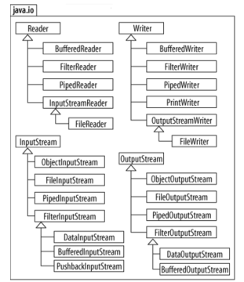
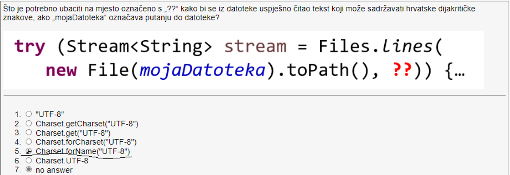
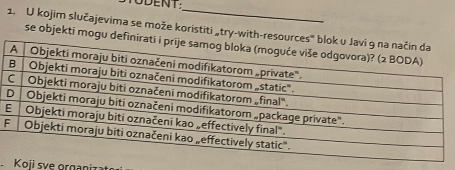
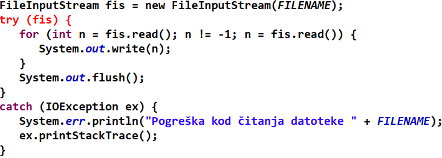
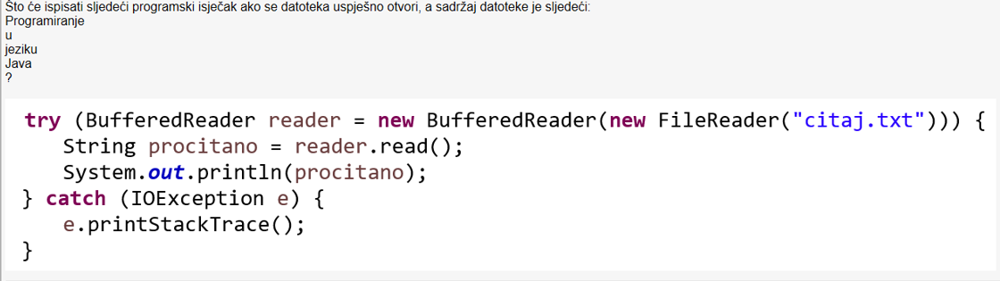
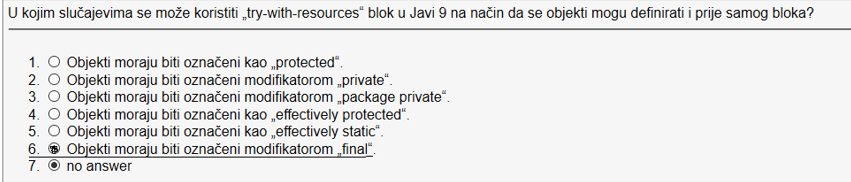
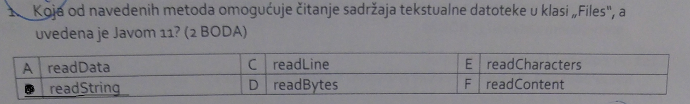
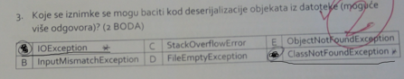
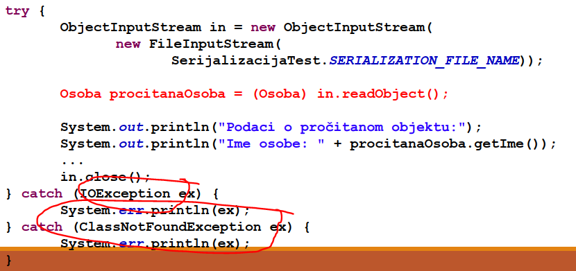

# Datoteke u Javi
- Datoteke se koriste za trajnije pohranjivanje podataka
- Dvije vrste datoteka : teksutalne i binarne
- Svaka datoteka razmatra se kao niz bajtova (_stream of bytes_) i ima
`end of file` oznaku na kraju

## Vrste tokova podataka
- Binarni format: ulazni i izlazni tok su predstavljeni bajtovima (char - 2B, int 4B, double 8B)
- Kod otvaranje datoteke potrebno je kreirati pripadajuci objekt ciji konstruktor
komunicira sa OS-om
- Tri standarna toka podataka su:
  - System.in - (za ucitavanje sa tipkovnice)
  - System.out - (za ispis podataka na zaslon)
  - Syste,.err (za ispis podataka o pogreskama na zaslon)

## Klasa java.io.File
- Predsatavlja element datotecnog sustava (moze biti datoteka ili mapa)
- Sadrzi putanju ime i veliocinu datoteke, ali ne i sam sadrzaj
- Moze kreirati datoteku na sljedece nacine:
```java
    File wf1 = new File("moj.html");
    File wf2 = new File("java\\html\\IO.html");
    File wf3 = new File("D:\\java\\25.txt");
```
- Sadrzi metode koje provjeravaju postoji li datoteka (`exists`) je li datoteka
ili mapa (`isFile` i `isDirectory`), za dohvat naziva i putanje (`getName` ili `getPath`) itd.

## Paket java.nio.file
Sva navedevna sucelja uvedena su od JAVE SE 6
- Sucelje `Path` : objekti klasa koji implementiraju to sucelje predstavljaju
lokaciju datoteka ili mape, ali ne omogucvaju citanje sadrzaja datoteke
- Klasa `Paths`: sadrzi staticke metode za dohvat `Path` objekata koji predstavljaju
datoteku ili mapu
- Klasa `Files`: sadrzi staticke metode za rad sa datotekama ili mapama
- Sucelje `DirectoryStream`: objekti kalsa koji implementiraju to sucelje mogu
koristiti sadrzaj datoteke:

### Primjer Path sucelja, klasa Paths i Files i sucelja DirectoryStream:
```java
        Scanner input = new Scanner(System.in);
        System.out.println("Unesite naziv datoteke ili mape:");
        Path path = Paths.get(input.nextLine()); // ovdje se pretvara string odnosno putanja datoteke u objekt tipa Path
        if (Files.exists(path))
        {
        System.out.printf("%n%s postoji%n",path.getFileName());
        System.out.printf("%s mapa %n",Files.isDirectory(path)?"je":"nije");
        System.out.printf("%s apsolutna putanja %n",path.isAbsolute()?"je":"nije");
        System.out.printf("Posljednja promjena: %s%n",Files.getLastModifiedTime(path));
        System.out.printf("Veličina: %s%n",Files.size(path));
        System.out.printf("Putanja: %s%n",path);
        System.out.printf("Apsolutna putanja: %s%n",path.toAbsolutePath());
        if(Files.isDirectory(path)){
              System.out.printf("%nSadržaj mape:%n");
              DirectoryStream<Path> directoryStream=Files.newDirectoryStream(path);
              for(Path p:directoryStream)
              System.out.println(p);
            }
        }
        else {
            System.out.printf("%s ne postoji!%n", path);
        }
```
## Neke od metoda Paths sucelja

```java
// Primjeri metoda Paths sucelja
        //Normalizes this path, removing redundant elements such as "." and "..".
        Path dirtyPath = Paths.get("/home/user/./../documents/file.txt");
        Path cleanPath = dirtyPath.normalize();
        //Returns the absolute form of this path.
        Path relativePath = Paths.get("documents/file.txt");
        Path absolutePath = relativePath.toAbsolutePath();
        //Returns the parent path or null if this path does not have a parent.
        Path filePath = Paths.get("/home/user/documents/file.txt");
        Path parentPath = filePath.getParent();
        //Returns the file or directory name at the end of this path.
        Path filePath2 = Paths.get("/home/user/documents/file.txt");
        Path fileName = filePath2.getFileName();
        //Returns the number of elements in the path.
        Path filePath3 = Paths.get("/home/user/documents/file.txt");
        int nameCount = filePath3.getNameCount();
        //Returns the name element at the specified index in the path.
        Path filePath4 = Paths.get("/home/user/documents/file.txt");
        Path element = filePath4.getName(2); // Returns "documents"
        //Returns a relative subpath of this path.
        Path filePath5 = Paths.get("/home/user/documents/file.txt");
        Path subpath = filePath5.subpath(1, 3); // Returns "user/documents"
        //Tests if this path starts with the given path.
        Path basePath = Paths.get("/home/user");
        Path testPath = Paths.get("/home/user/documents/file.txt");
        boolean startsWith = testPath.startsWith(basePath); // true
        //Tests if this path ends with the given path.
        Path basePath2 = Paths.get("/home/user");
        Path testPath2 = Paths.get("/home/user/documents/file.txt");
        boolean endsWith = testPath2.endsWith("documents/file.txt"); // true

```

## Primjeri metoda Files klase

```java
Path path = Path.of("dats/citaj.txt");
        Path directoryPath = Path.of("./dats");
        // dohvacanje svih linija datoteke na nekoj putanji
        try (Stream<String> lines = Files.lines(path)) {
            lines.forEach(System.out::println);
        } catch (IOException e) {
            e.printStackTrace();
        }
        // citanje datoteka u nekom direktoriju
        try (Stream<Path> files = Files.list(directoryPath)) {
            files.forEach(System.out::println);
        } catch (IOException e) {
            e.printStackTrace();
        }
        //otvaranje mapa i omogucava citanje njenog sadrzaja
        try (DirectoryStream<Path> directoryStream = Files.newDirectoryStream(directoryPath)) {
            directoryStream.forEach(System.out::println);
        } catch (IOException e) {
            e.printStackTrace();
        }
        //Otvaranje mapa i podmapa u hijerarhiji
        try (Stream<Path> walk = Files.walk(directoryPath)) {
            walk.forEach(System.out::println);
        } catch (IOException e) {
            e.printStackTrace();
        }
        // citanje cijele dataoteke pomocu readString metode
        try {
            String content = Files.readString(path);
            System.out.println(content);
        } catch (IOException e) {
            e.printStackTrace();
        }
        // filtriranje datoteka na zadanoj putanji
        try (Stream<Path> files = Files.list(directoryPath)) {
            files.filter(Files::isRegularFile)
                    .filter(path1 -> path1.toString().endsWith(".txt"))
                    .forEach(System.out::println);
        }

```


## Klasa Formater
- Sluzi za oblikovanje teksta koji se moze zapisivati u datoteku po principu
koristenja metode printf, kao u C-u
### Primjer koristenja te klase:
```java
  Formatter output = new Formatter("clients.txt");
    output.format("%d %s %s %.2f%n", cijeliBroj,string1,string2,double);
```
- U slucaju nedostatka prava za koristenje datoteke baca se iznimka `SecurityException`
## Tokovi za citanje i zapisivanje podataka u datoteke
- Postoje ulazni  i izlazni tokovi podataka
- Osnovne apstraktne klase za citanje i pisanje u binarne datoteke su:
java.io.InputStream(salje bajtove iz vanjskog izvora u Java program), 
java.io.OutputStream(salje bajtove iz Java programa u neko vanjsko odrediste)
- Osnovne apstraktne klase za citanje i pisanje u teksutalne datoteke su:
java.io.Reader(prima znakove iz vanjskoh izvora i salje ih u Java program), 
java.io.Writer( salje znakove iz Java programa u vanjski izvor)



## Binarne datoteke
Osnovna metoda klase `InputStream` je `public abstract int read() throws IOException`
- cita 1 bajt iz ulaznog toka, a vraca cjelobrojnu vrijednost tog bajta
- metoda read blokira izvodenje ostakta programa tako dugo dok se bajt ne procita

Osnovna metoda klase `OutputStream` je `public abstract void write(int b) throws IOException`
- salje 1 bajt podataka preko izlatnog toka do odredista koje taj znak interpretira na odredeni nacin
### Primjer citanja Binarne datoteke
```java
public static final String FILENAME = "datumi.dat";
public static final int DATE_FORMAT_LENGTH = "dd.MM.yyyy.".length();
public static void main(String[] args) {
  try {
    InputStream in = new FileInputStream(FILENAME);
    char[] data = new char[DATE_FORMAT_LENGTH];
    for (int i = 0; i < data.length; i++) {
    int datum = in.read();
    if (datum == -1)
    break;
    data[i] = (char) datum;
  }
    System.out.println("Pročitani datum : " + String.valueOf(data));
    in.close();
  } catch (IOException ex) {
    System.err.println(ex.getMessage());
  }
}
```
### Primjer kopiranja Binarne datoteke koristenjem Files klase
```java
  public static void copyFile(File from, File to) throws IOException {
        Files.copy(from.toPath(), to.toPath());
}
```
### Primjer citanja tekstualne datoteke:
```java
public static final String FILE_NAME = "input.txt";
try (BufferedReader in = new BufferedReader(new FileReader(FILE_NAME))) {
  String line;
  while ((line = in.readLine()) != null) {
  System.out.println(line);
    }
} catch (IOException e) {
  System.err.println(e);
}
// ili u Javi 11
        Path datoteka = Path.of("datoteka.txt");
        try {
          String tekst = Files.readString(datoteka);
          System.out.println("Pročitana datoteka:");
          System.out.println(tekst);
        } catch (IOException e) {
          e.printStackTrace();
        }
```
## Blok try-with-resources
Od jave 7 uveden je poseban try-catch block koji automatski poziva metode close, a izgleda ovako:
```java
try (FileInputStream fis = new FileInputStream(FILENAME)) {
  for (int n = fis.read(); n != -1; n = fis.read()) {
  System.out.write(n);
}
    System.out.flush();
}
catch (IOException ex) {
  System.err.println("Pogreška kod čitanja datoteke " + FILENAME);
  ex.printStackTrace();
}
```
### Primjer zapisivanje u tekstualne datoteke:
```java
  public static final String FILE_NAME = "output.txt";
public static void main(String[] args) {
        try (PrintWriter out = new PrintWriter(
          new FileWriter(new File(FILE_NAME)))) {
          int i = 0;
          do {
          out.println((i + 1) + ". redak");
          i++;
        }while (i < 10);
        } catch (IOException e) {
            System.err.println(e);
            }
        }
        //ili u Javi 11
        String tekst = "Ovo je tekst koji se zapisuje u datoteku!\nDrugi redak teksta";
        Path datoteka = Path.of("datoteka.txt");
        try {
            Files.writeString(datoteka, tekst);
        } catch (IOException e) {
          e.printStackTrace();
        }
```

Od Jave 9 je moguce koristit taj blok na nacin da se objekti mogu definirati i prije bloka
i samo se koristiti u njemu, ali moraju biti `final` ili `effectively final`:

```java
FileInputStream fis = new FileInputStream(FILENAME);
try (fis) {
  for (int n = fis.read(); n != -1; n = fis.read()) {
  System.out.write(n);
}
    System.out.flush();
}
catch (IOException ex) {
  System.err.println("Pogreška kod čitanja datoteke " + FILENAME);
  ex.printStackTrace();
}
```
## Koristenje `streamova u radu s datotekama`:
Klasa „Files” sadrži i nekoliko metoda koje su vezane uz streamove i drastično
olakšavaju rad s datotekama:
- lines(Path putanja) – dohvaća sve linije unutar datoteke na zadanoj putanji
- list(Path putanja) – dohvaća sve datoteke na zadanoj putanji
- newDirectoryStream(Path putanja) – otvara mapu i omogućava dohvaćanje njenog sadržaja
- walk(Path putanja) – otvara mape i sve podmape u hijerarhiji te omogućava dohvaćanje
sadržaja tih mapa
- readString – čita cijeli sadržaj datoteke u jedan String s opcijom definiranja „CharacterSeta”
- writeString – zapisuje cijeli String u datoteku s opcijom definiranja „CharacterSeta”
- Nakon dohvaćanja podataka o datotekama, moguće je koristiti razne metode za
manipulaciju tih podataka temeljene na lambda izrazima kao što su filter, foreach, limit,
map itd.

Primjer:
```java
try (Stream<String> stream = Files.lines(new File("dat/radneMemorije.txt").toPath())) {
    listaStringova = stream.collect(Collectors.toList());
} catch (IOException e) {
e.printStackTrace();
  logger.error("Došlo je do pogreške u čitanju datoteke!", e);
}
        Files.list(new File(".").toPath())
        .filter(p -> !p.getFileName()
        .toString().startsWith("."))
        .limit(3)
        .forEach(System.out::println);
        Files.walk(new File(".").toPath())
        .filter(p -> !p.getFileName()
        .toString().startsWith("."))
        .forEach(System.out::println);
``` 
## Serijalizacija i deserijalizacija u Javi
- Serijalizacija je nacin da spremimo cijeli objekt u binarnu datoteku
- Deserijalizacija je samo obrnuto odnosno citamo cijeli datotek iz binarne daoteke

Serijalizacija:
```java
  ObjectOutputStream out = new ObjectOutputStream(
  new FileOutputStream("osobe.dat"));
  Zupanija zagrebacka = new Zupanija("Zagrebačka", 309696, 3078d,
  Zupanija.POZIVNI_BROJ_ZUPANIJA_ZAGREBACKA_GRAD_ZAGREB);
  Osoba osoba = new Osoba("Pero", "Perić", zagrebacka, new Date());
  out.writeObject(osoba);
  out.close();
```
Deserijalizacija:
```java
try {
  ObjectInputStream in = new ObjectInputStream(
  new FileInputStream(
  SerijalizacijaTest.SERIALIZATION_FILE_NAME));
  Osoba procitanaOsoba = (Osoba) in.readObject();
  System.out.println("Podaci o pročitanom objektu:");
  System.out.println("Ime osobe: " + procitanaOsoba.getIme());
  ...
    in.close();
} catch (IOException ex) {
  System.err.println(ex);
} catch (ClassNotFoundException ex) {
    System.err.println(ex);
}
```

# Zadaci iz kolokvija
1. zad:



Rješenje:
```java
try (Stream<String> stream = Files.lines(new File("mojaDat.txt").toPath(),Charset.forName("UTF-8"))){
        } catch (IOException e) {
            throw new RuntimeException(e);
        }
```
2. zad:



Rješenje: C i E

Primjer:



3. zad:



Rijesenje: Neće se ispisati nista zbog greske kod prevodanja programskog isjecka
Greska je u tome sto metoda read() vraca int, a ne String

4. zad:



Rijesenje:6. i ovdje nije ponudeno ali mogu biti i `effectively final`

5. zad:


Rijesenje: readString();

**Primjer readString() i readAllLines() metoda sa definiranim characterSetom**:
```java
public class Main {
    public static void main(String[] args) throws IOException {
        Path path = Paths.get("./dats/citaj.txt");
        if(Files.exists(path)){
            String tekstIzDat = Files.readString(path, Charset.forName("UTF-8"));
            List<String> linijeIzDat = Files.readAllLines(path, Charset.forName("UTF-8"));
            System.out.println("Tekst iz datoteke: ");
            //Ispis
            /*
            * Programiranje
            * u
            * jeziku
            * java
            * */
            System.out.println(tekstIzDat);
            System.out.println(linijeIzDat); // ispis : [Programiranje, u, jeziku, Java]
        }
    }
}
```


6. zad:



Rijesenje: ClassNotFoundException i IOException
Primjer: 




# PRIMJERI KODOVA ZA DATOTEKE
```java
public class Main {

    public static void main(String[] args) throws IOException {
        Path path = Path.of("./dats/citaj.txt");
        // Svi primjeri citanja, pisanja, kopiranja tekstualnih i binarnih datoteka
        //Tekstualne - citanje 1 nacin
        try(BufferedReader in = new BufferedReader(new FileReader(String.valueOf(path)))){
                String line;
                Stream<String> lin = in.lines();
                List<String> list = lin.collect(Collectors.toList());
                System.out.println("Streamovi");
                System.out.println(list); // ispis [Programiranje, u, ježiku, Java]
                while((line = in.readLine())!=null){
                    System.out.println(line);
                }
        }catch (IOException e){

        }
        //Tekstualne - citanje 2 nacin
        String cijeliFile = Files.readString(path);
        System.out.println(cijeliFile);

        // Teksutalne - citanje 3. nacin
        // Ovaj nacin se koristi kod binarnih datoteka jer se one citaju po vrijednosti bajtova
        // Ovdje takoder imamo problem sto nemamo definiran charSet pa se sve vrijednosti ne ispisuju dobro
        try (FileInputStream in = new FileInputStream(String.valueOf(path))){
            int procitani;
                while ((procitani = in.read())!=-1){
                    char character = (char) procitani;
                    System.out.print(character);
                }
        }catch (IOException e){

        }
        // Tekstutalne zapisivanje 1- nacin
        // Kada ovo napravimo samo nam rewritea cijelu datoteku
        try(BufferedWriter out = new BufferedWriter(new FileWriter(String.valueOf(path)))){

                String neki = "Neki string za zapisati u datoteku";
                out.write(neki);
        }catch (IOException e){

        }
        // Tekstutalne zapisivanje 2- nacin
        // Kada stavimo drugi element konstruktora FileWritera na true onda omogocuvamo appendanje elemenata na kraj datotek
        try(BufferedWriter out = new BufferedWriter(new FileWriter(String.valueOf(path),true))){
            // Kada ovo napravimo samo nam rewritea cijelu datoteku
            String neki = "Neki string za zapisati u datoteku";
            out.newLine();
            out.write(neki);
            out.newLine();
        }catch (IOException e){

        }
        // Tekstualne zapisivanje 3- nacin, ovaj nacin nam isto rewritea cijelu datoteku
        String cijeliStrin = "Daj upisi mi cijeli String u datoteku odjednom";
        Files.writeString(path,cijeliStrin);
        // Tekstualne zapisivanje 4- nacin, kada dodamo StandardOpenOption.APPEND onda nam nece vise rewriteati cijelu datoteku
        String cijeliString = "Daj upisi mi cijeli String u datoteku odjednom";
        Files.writeString(path,cijeliString, StandardCharsets.UTF_8, StandardOpenOption.APPEND);
        // Tekstualne zapisivanje 5 - nacin ovdje isto vrijedi vrijednost u konstruktoru ako zelimo appendati na kraj datoteke
        try(FileOutputStream out = new FileOutputStream(String.valueOf(path),true)){
                int upisani;

                String stringKojiTribaUpisat  = " When someone says to you imaš dobra jaja it means you have good balls";
                //Prvo moramo pretvoriti string u bajtove jer FileOutputStream objekt koristi bajtove za zapisivanje u datoteku
                byte[] bytes = stringKojiTribaUpisat.getBytes(Charset.forName("UTF-8")); // ovdje takoder mozemo definirati koji cemo charSet koristiti
                out.write(bytes);

        }catch (IOException ex){

        }
        // Tekstualne zapisivanje 6. nacin
        // PrintWriter se uglavnom koristi kada trebamo formatirati tekst koji zapisujemo u datoteku
        try(PrintWriter in = new PrintWriter(new FileWriter(String.valueOf(path),true))){
                System.out.println("String sa printWriterom");
                in.println("Nig");
        }

        //Binarne datoteke zapisivanje
        Path binarna = Paths.get("./dats/binarna.bin");
        Path binarna2 = Paths.get("./dats/binarna2.bin");
        //System.out.println(Files.exists(binarna));
        try(FileOutputStream out = new FileOutputStream(String.valueOf(binarna),true)){
            String zap = "Zapiši\n";
            byte[] bytes = zap.getBytes(Charset.forName("UTF-8"));
            out.write(bytes);
        }catch (IOException ex){

        }
        // Binarne datoteke citanje
        try(FileInputStream in = new FileInputStream(String.valueOf(binarna))){
            // Da bi ovdje definirali charSet mozemo napraviti ovo
                InputStreamReader inputStreamReader = new InputStreamReader(in,Charset.forName("UTF-8"));
                // i onda u while-u za citanje koristimo ovaj inputStreamReader umjesto in (objekta klase FileInputStream)
                int procitani;
                while((procitani = in.read())!=-1){
                    char character = (char) procitani;
                    System.out.print(character);
                }
        }catch (IOException ex){

        }
        // Binarne datoteke kopiranje 1. nacin
        try(FileInputStream in = new FileInputStream(String.valueOf(binarna));
            FileOutputStream out = new FileOutputStream(String.valueOf(binarna2))
        ){
            int procitani;
            while((procitani = in.read())!=-1){
                    out.write(procitani);
            }
        }catch (IOException e){
            
        }
        // Binarne datoteke kopiranje 2. nacin
        // Prvo treba izbrisati odredisnu datoteku jer ce inace baciti exception FileAlreadyExistsException
        Files.delete(binarna2);
        Files.copy(binarna,binarna2);
        // Tekstualne datoteke se mogu kopirati na iste nacine
    }

}
```