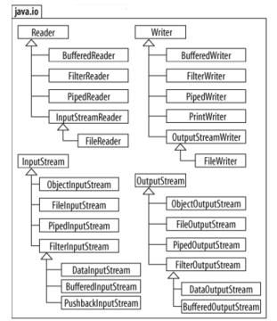

# Datoteke u Javi
- Datoteke se koriste za trajnije pohranjivanje podataka
- Dvije vrste datoteka : teksutalne i binarne
- Svaka datoteka razmatra se kao niz bajtova (_stream of bytes_) i ima
`end of file` oznaku na kraju

## Vrste tokova podataka
- Binarni format: ulazni i izlazni tok su predstavljeni bajtovima (char - 2B, int 4B, double 8B)
- Kod otvaranje datoteke potrebno je kreirati pripadajuci objekt ciji konstruktor
komunicira sa OS-om
- Tri standarna toka podataka su:
  - System.in - (za ucitavanje sa tipkovnice)
  - System.out - (za ispis podataka na zaslon)
  - Syste,.err (za ispis podataka o pogreskama na zaslon)

## Klasa java.io.File
- Predsatavlja element datotecnog sustava (moze biti datoteka ili mapa)
- Sadrzi putanju ime i veliocinu datoteke, ali ne i sam sadrzaj
- Moze kreirati datoteku na sljedece nacine:
```java
    File wf1 = new File("moj.html");
    File wf2 = new File("java\\html\\IO.html");
    File wf3 = new File("D:\\java\\25.txt");
```
- Sadrzi metode koje provjeravaju postoji li datoteka (`exists`) je li datoteka
ili mapa (`isFile` i `isDirectory`), za dohvat naziva i putanje (`getName` ili `getPath`) itd.

## Paket java.nio.file
Sva navedevna sucelja uvedena su od JAVE SE 6
- Sucelje `Path` : objekti klasa koji implementiraju to sucelje predstavljaju
lokaciju datoteka ili mape, ali ne omogucvaju citanje sadrzaja datoteke
- Klasa `Paths`: sadrzi staticke metode za dohvat `Path` objekata koji predstavljaju
datoteku ili mapu
- Klasa `Files`: sadrzi staticke metode za rad sa datotekama ili mapama
- Sucelje `DirectoryStream`: objekti kalsa koji implementiraju to sucelje mogu
koristiti sadrzaj datoteke:

### Primjer Path sucelja, klasa Paths i Files i sucelja DirectoryStream:
```java
        Scanner input = new Scanner(System.in);
        System.out.println("Unesite naziv datoteke ili mape:");
        Path path = Paths.get(input.nextLine()); // ovdje se pretvara string odnosno putanja datoteke u objekt tipa Path
        if (Files.exists(path))
        {
        System.out.printf("%n%s postoji%n",path.getFileName());
        System.out.printf("%s mapa %n",Files.isDirectory(path)?"je":"nije");
        System.out.printf("%s apsolutna putanja %n",path.isAbsolute()?"je":"nije");
        System.out.printf("Posljednja promjena: %s%n",Files.getLastModifiedTime(path));
        System.out.printf("Veličina: %s%n",Files.size(path));
        System.out.printf("Putanja: %s%n",path);
        System.out.printf("Apsolutna putanja: %s%n",path.toAbsolutePath());
        if(Files.isDirectory(path)){
              System.out.printf("%nSadržaj mape:%n");
              DirectoryStream<Path> directoryStream=Files.newDirectoryStream(path);
              for(Path p:directoryStream)
              System.out.println(p);
            }
        }
        else {
            System.out.printf("%s ne postoji!%n", path);
        }
```
## Klasa Formater
- Sluzi za oblikovanje teksta koji se moze zapisivati u datoteku po principu
koristenja metode printf, kao u C-u
### Primjer koristenja te klase:
```java
  Formatter output = new Formatter("clients.txt");
    output.format("%d %s %s %.2f%n", cijeliBroj,string1,string2,double);
```
- U slucaju nedostatka prava za koristenje datoteke baca se iznimka `SecurityException`
## Tokovi za citanje i zapisivanje podataka u datoteke
- Postoje ulazni  i izlazni tokovi podataka
- Osnovne apstraktne klase za citanje i pisanje u binarne datoteke su:
java.io.InputStream(salje bajtove iz vanjskog izvora u Java program), 
java.io.OutputStream(salje bajtove iz Java programa u neko vanjsko odrediste)
- Osnovne apstraktne klase za citanje i pisanje u teksutalne datoteke su:
java.io.Reader(prima znakove iz vanjskoh izvora i salje ih u Java program), 
java.io.Writer( salje znakove iz Java programa u vanjski izvor)



## Binarne datoteke
Osnovna metoda klase `InputStream` je `public abstract int read() throws IOException`
- cita 1 bajt iz ulaznog toka, a vraca cjelobrojnu vrijednost tog bajta
- metoda read blokira izvodenje ostakta programa tako dugo dok se bajt ne procita

Osnovna metoda klase `OutputStream` je `public abstract void write(int b) throws IOException`
- salje 1 bajt podataka preko izlatnog toka do odredista koje taj znak interpretira na odredeni nacin
### Primjer citanja Binarne datoteke
```java
public static final String FILENAME = "datumi.dat";
public static final int DATE_FORMAT_LENGTH = "dd.MM.yyyy.".length();
public static void main(String[] args) {
  try {
    InputStream in = new FileInputStream(FILENAME);
    char[] data = new char[DATE_FORMAT_LENGTH];
    for (int i = 0; i < data.length; i++) {
    int datum = in.read();
    if (datum == -1)
    break;
    data[i] = (char) datum;
  }
    System.out.println("Pročitani datum : " + String.valueOf(data));
    in.close();
  } catch (IOException ex) {
    System.err.println(ex.getMessage());
  }
}
```
### Primjer kopiranja Binarne datoteke koristenjem Files klase
```java
  public static void copyFile(File from, File to) throws IOException {
        Files.copy(from.toPath(), to.toPath());
}
```
### Primjer citanja tekstualne datoteke:
```java
public static final String FILE_NAME = "input.txt";
try (BufferedReader in = new BufferedReader(new FileReader(FILE_NAME))) {
  String line;
  while ((line = in.readLine()) != null) {
  System.out.println(line);
    }
} catch (IOException e) {
  System.err.println(e);
}
// ili u Javi 11
        Path datoteka = Path.of("datoteka.txt");
        try {
          String tekst = Files.readString(datoteka);
          System.out.println("Pročitana datoteka:");
          System.out.println(tekst);
        } catch (IOException e) {
          e.printStackTrace();
        }
```
## Blok try-with-resources
Od jave 7 uveden je poseban try-catch block koji automatski poziva metode close, a izgleda ovako:
```java
try (FileInputStream fis = new FileInputStream(FILENAME)) {
  for (int n = fis.read(); n != -1; n = fis.read()) {
  System.out.write(n);
}
    System.out.flush();
}
catch (IOException ex) {
  System.err.println("Pogreška kod čitanja datoteke " + FILENAME);
  ex.printStackTrace();
}
```
### Primjer zapisivanje u tekstualne datoteke:
```java
  public static final String FILE_NAME = "output.txt";
public static void main(String[] args) {
        try (PrintWriter out = new PrintWriter(
          new FileWriter(new File(FILE_NAME)))) {
          int i = 0;
          do {
          out.println((i + 1) + ". redak");
          i++;
        }while (i < 10);
        } catch (IOException e) {
            System.err.println(e);
            }
        }
        //ili u Javi 11
        String tekst = "Ovo je tekst koji se zapisuje u datoteku!\nDrugi redak teksta";
        Path datoteka = Path.of("datoteka.txt");
        try {
            Files.writeString(datoteka, tekst);
        } catch (IOException e) {
          e.printStackTrace();
        }
```

Od Jave 9 je moguce koristit taj blok na nacin da se objekti mogu definirati i prije bloka
i samo se koristiti u njemu, ali moraju biti `final` ili `effectively final`:

```java
FileInputStream fis = new FileInputStream(FILENAME);
try (fis) {
  for (int n = fis.read(); n != -1; n = fis.read()) {
  System.out.write(n);
}
    System.out.flush();
}
catch (IOException ex) {
  System.err.println("Pogreška kod čitanja datoteke " + FILENAME);
  ex.printStackTrace();
}
```
## Koristenje `streamova u radu s datotekama`:
Klasa „Files” sadrži i nekoliko metoda koje su vezane uz streamove i drastično
olakšavaju rad s datotekama:
- lines(Path putanja) – dohvaća sve linije unutar datoteke na zadanoj putanji
- list(Path putanja) – dohvaća sve datoteke na zadanoj putanji
- newDirectoryStream(Path putanja) – otvara mapu i omogućava dohvaćanje njenog sadržaja
- walk(Path putanja) – otvara mape i sve podmape u hijerarhiji te omogućava dohvaćanje
sadržaja tih mapa
- readString – čita cijeli sadržaj datoteke u jedan String s opcijom definiranja „CharacterSeta”
- writeString – zapisuje cijeli String u datoteku s opcijom definiranja „CharacterSeta”
- Nakon dohvaćanja podataka o datotekama, moguće je koristiti razne metode za
manipulaciju tih podataka temeljene na lambda izrazima kao što su filter, foreach, limit,
map itd.

Primjer:
```java
try (Stream<String> stream = Files.lines(new File("dat/radneMemorije.txt").toPath())) {
    listaStringova = stream.collect(Collectors.toList());
} catch (IOException e) {
e.printStackTrace();
  logger.error("Došlo je do pogreške u čitanju datoteke!", e);
}
        Files.list(new File(".").toPath())
        .filter(p -> !p.getFileName()
        .toString().startsWith("."))
        .limit(3)
        .forEach(System.out::println);
        Files.walk(new File(".").toPath())
        .filter(p -> !p.getFileName()
        .toString().startsWith("."))
        .forEach(System.out::println);
``` 
## Serijalizacija i deserijalizacija u Javi
- Serijalizacija je nacin da spremimo cijeli objekt u binarnu datoteku
- Deserijalizacija je samo obrnuto odnosno citamo cijeli datotek iz binarne daoteke

Serijalizacija:
```java
  ObjectOutputStream out = new ObjectOutputStream(
  new FileOutputStream("osobe.dat"));
  Zupanija zagrebacka = new Zupanija("Zagrebačka", 309696, 3078d,
  Zupanija.POZIVNI_BROJ_ZUPANIJA_ZAGREBACKA_GRAD_ZAGREB);
  Osoba osoba = new Osoba("Pero", "Perić", zagrebacka, new Date());
  out.writeObject(osoba);
  out.close();
```
Deserijalizacija:
```java
try {
  ObjectInputStream in = new ObjectInputStream(
  new FileInputStream(
  SerijalizacijaTest.SERIALIZATION_FILE_NAME));
  Osoba procitanaOsoba = (Osoba) in.readObject();
  System.out.println("Podaci o pročitanom objektu:");
  System.out.println("Ime osobe: " + procitanaOsoba.getIme());
  ...
    in.close();
} catch (IOException ex) {
  System.err.println(ex);
} catch (ClassNotFoundException ex) {
    System.err.println(ex);
}
```