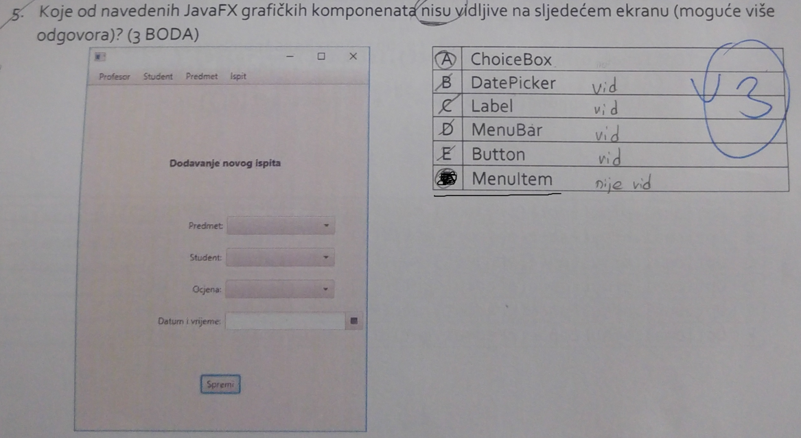
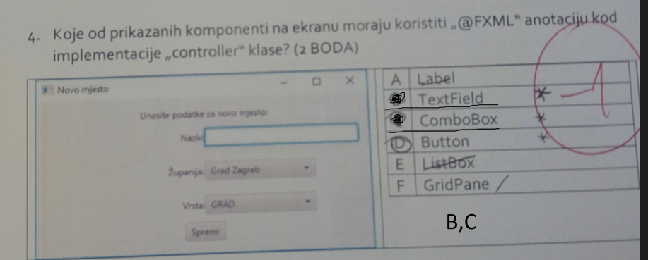

# JavaFX
JavaFX je Java library za stvaranje grafickih sucelja. Svaka GUI komponenta
je takoder objekt koji se moze koristiti pomocu misa i tipkovnice. U javu je od
samih pocetaka uveden GUI library pod nazivom AWT (Abstract Window Toolkit). Od
Jave SE 1.2 koristi se _Swing_ library koji je primarni skup alata za cuelja u Javi sve do JAVE SE 7
## JavaFX API 
- prvi put je objavljen 2007. godine kao konkuretna tehnlogoija Microsoft Silverlightu
- prva verzija 1.0 objavljena je 2008.godine
- Prije verzije 2.0  koristio se JavaFx Script koji je bio slican JavaScriptu
i prevodio je izvorni kod u bytecode i mogao se izvoditi na JVM
- Od verzije 2.0 koja je objavljena 2011. godine JavaFX je implementiran kao
  skupina librarya
- Objavom Jave 8 objavljena je inačica JavaFX 8

## Primjer JAVAFX aplikacije
```java
public class Main extends Application {
    @Override
    public void start(Stage primaryStage) {
    try {
        BorderPane root = new BorderPane();
        Scene scene = new Scene(root,400,400);
        scene.getStylesheets().add(getClass().getResource(
        "application.css").toExternalForm());
        primaryStage.setScene(scene);
        primaryStage.show();
    } catch(Exception e) {
        e.printStackTrace();
    }
}
public static void main(String[] args) {
launch(args);
}
}
```
Objasnjenje:
- Svaka klasa koja predstavlja polaznu točku JavaFX aplikacije mora nasljeđivati klasu
„javafx.application.Application” koja omogućava funkcionalnosti životnog ciklusa
aplikacije kao što su inicijalizacija, pokretanje ili zaustavljanje izvođenja aplikacije
-  Omogućava upravljanje aplikacijom odvojeno od glavne niti
- Sadrži metodu „launch” koja poziva nadjačanu metodu „start”
- Metoda „start” prima objekt klase „javafx.stage.Stage” koji omogućava pokretanje
zasebne niti koja će se izvoditi na grafičkom sučelju aplikacije
- Objekt klase „Scene” potrebno je dodati u objekt klase „Stage” koji omogućava prikaz
grafičkog sučelja
- Koncept JavaFX Scene Graph omogućava korištenje više različitih „Scene” objekata na
jednom „Stage” objektu
- Objekti klase „Scene” omogućavaju postavljanje veličine ekrana, naslova, kao i
  samog organizatora rasporeda komponenti (engl. Layout), npr.: „BorderPane”
- Osim toga omogućeno je definiranje lokacije i naziva CSS datoteke u kojoj se
  nalaze definicije stilova koji se koriste na grafičkom sučelju:
  `scene.getStylesheets().add(getClass().getResource(
  "application.css").toExternalForm());`
- CSS stilovi koji se koriste kod JavaFX-a moraju sadržavati „-fx” prefiks, a mogu se
  primjenjivati korištenjem metode „setStyle”, npr:
  `root.setStyle("-fx-background: rgb(225, 228, 203)");
  primaryStage.setScene(scene);`

## FXML
Scene Builder omogucava dizajniranje grafickog sucelja aplikacije koristenjem
posebno oblikovane XML datoteke koja ima ekstenziju ".fxml" (FX Markup Language)
### Primjer izgleda FXML datoteke:
```java
    <?xml version="1.0" encoding="UTF-8"?>
        <?import javafx.scene.control.*?>
        <?import java.lang.*?>
        <?import javafx.scene.layout.*?>
        <?import javafx.scene.layout.BorderPane?>
<BorderPane prefHeight="287.0" prefWidth="286.0"
        xmlns:fx="http://javafx.com/fxml/1"
        xmlns="http://javafx.com/javafx/8"
        fx:controller="application.SampleController">
<center>
<Button mnemonicParsing="false" text="Moj gumb"
        BorderPane.alignment="CENTER" />
</center>
</BorderPane>
```
## Organizatori rasporeda komponenti
- ### HBox:
  - postavlje elemene te u horiznotalni redak jedan iza drugog
  - Omogucava definiranje razmaka izmedu komponenata koje se mogu mijenjati
  u ovisnosti o velicini komponente (prozora u kojem se nalaze)
  - Primjer:
  
  
- ### VBox:
  - postavlja elemente u vertikalni redak (stupac) jednog ispod drugog
  - Primjer: 
  
  
- ### FlowPane
  - Omogucava postavljanje komponenti jedne iza druge do kraja raspolozivog retka
  nakon cega se nastavlja u sljedecem retku
  - Primjer:
  
- ### BorderPane
  - Omogucava postavaljenje komponenti u pet razlicitih podrucja:
  TOP, LEFT, CETNER, RIGHT, BOTTOM
  - Iako svako podrucje moze imati samo jednu komponentu, moguce je ubaciti drugi
  ugnjezdenji organizator rasporeda komponenti
  - Primjer:
  
- ### GridPane
    - Omogucava umetanje elemenata na graficko sucelje koristenjem tablice
  koja ima odreden broj redaka i stupaca
    - Prikladan za kreiranje ekrana koji sadrze forme za unos podataka 

## Zadaci sa kolokvija

1.zad:


Riješenje: void initialize() => na ovo mozemo gledati kao konstruktor ekrana koji se ucita u JavaFx

2. zad:


Riješenje: FlowPane, HBox, Vbox i BorderPane => Jos provjeriti

3. zad:


Riješenje: TextField,

Controller => Ne postoji

Scrollbar izgleda ovako te imamo horizontalni i vertikalni


4. zad:


GridPane koristi zamijenjene pozicije indeksa za retke i stupce

Primjer:
```java
public class GridPaneExample extends Application {

    @Override
    public void start(Stage primaryStage) {
        GridPane gridPane = new GridPane();

        // Dodajemo nekoliko dugmadi na različite pozicije unutar GridPane-a
        Button button1 = new Button("Button 1");
        gridPane.add(button1, 0, 0); // Stupac 0, Red 0

        Button button2 = new Button("Button 2");
        gridPane.add(button2, 1, 0); // Stupac 1, Red 0

        Button button3 = new Button("Button 3");
        gridPane.add(button3, 0, 1); // Stupac 0, Red 1

        Button button4 = new Button("Button 4");
        gridPane.add(button4, 1, 1); // Stupac 1, Red 1

        Scene scene = new Scene(gridPane, 300, 200);
        primaryStage.setTitle("GridPane Example");
        primaryStage.setScene(scene);
        primaryStage.show();
    }

    public static void main(String[] args) {
        launch(args);
    }
}
```


5. zad:


Rijesenje:


Kao što piše ovdje ne treba napraviti nista jer se `initialize` metoda ponasa kao konstruktor
odnosno poziva se automatski kada se ucita ekran koji koristi `StartController`.

6. zad:


Kao što je obojano crnom bojom vidi se Menu, tocno bi bilo i da kazemo da se vidi 
MenuBar zato sto je MenuBar kontejner za Menu komponente. Menu komponente su u ovom slucaju
`Županije`,`Simpotomi`,`Bolesti`,`Virusi` i `Osobe`. Tko god da je rijesavao ovaj ispit
je zaokruzio MenuItem sto je netocno. MenuItem je komponenta koja nam iskoci kada hoveramo
preko Menu komponente.

Primjer MenuItema i ostalih komponenta:


7. zad:


8. zad:


9. zad:



10. zad: 


11. zad:


12. zad:



13. zad:


14. zad:


Rijesenje: F