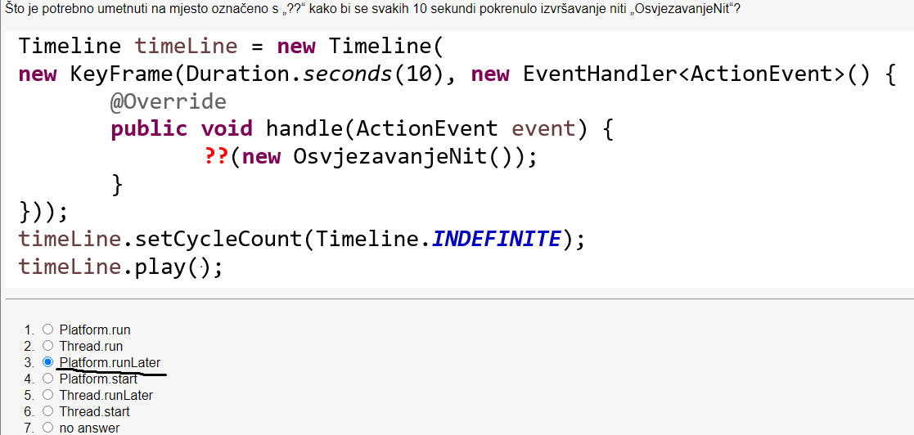
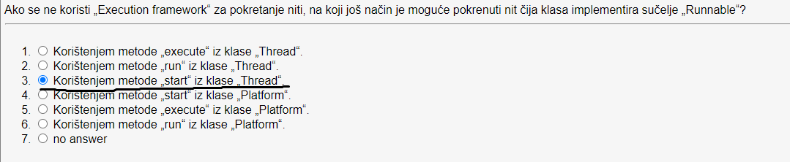
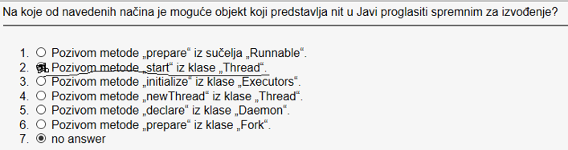
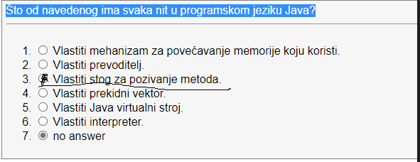
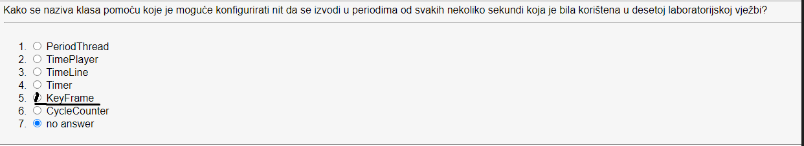
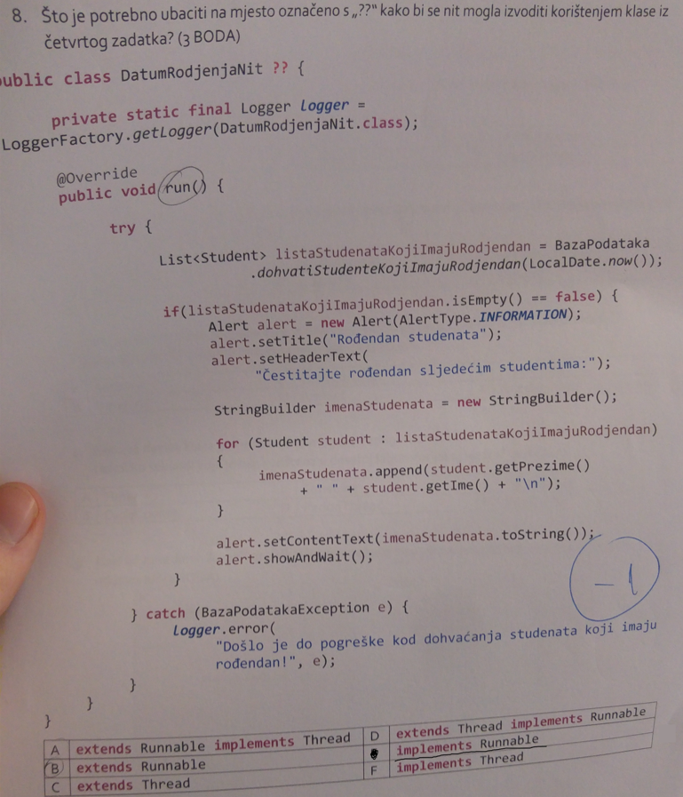
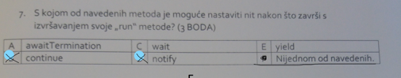
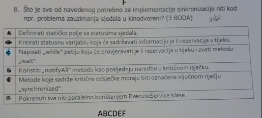

# Threadovi
- Visenitnost se u programiranju koristi kad je portrebno istovremeno paralelno izvodenje vise zadataka
- U Javi je moguce koristiti niti uz pomoc API-a koji je ugraden u jezik
- Svaka nit ima vlastiti stog za pozivanje metoda (call stack) i vlastito programsko
brojilo (program counter)
- Niti mogu međusobno dijeltiti resurse poput memorije ili datoteke
- Neželjna posljedica koja se moze pojaviti je deadlock (zastoj) kada niti
nisu dobro sinkronizirane

## Stanja i zivotni ciklus niti
- Stanja New i Runnable: nit zapocinje svoj zivotni ciklus u New stanju i ostaje
u njemu dok program ne pokrene nit, a nakon toga ulazi u Runnable stanje u kojem izvodi zadatak
- Stanje Waiting: nit moze iz stanja Runnable prijeci u stanje Waiting u kojem ceka
na to da neka druga nit obavi zadatak, kako bi nakon toga ona mogla nastaviti s radom
- Stanje Timed Waiting: nit moze uci u to stanje u slucaju kad je potrebno cekati zadani vremenski interval
- Niti u Waiting i Timed Waiting stanjima ne mogu koristiti procesor
- Stanje Blocked: nit ulazi u stanje Blocked u slucaju kad treba obaviti neki zadatak
koji ne moze odmah izvrsiti, jer ovisi o nekim resursima koje su zauzele druge niti i mora cekati na njih
- Nit u stanju Blocked ne moze koristiti procesor
- Stanje Terminated: nit ulazi u stanje Terminated kad zavrsi svoj zadatak ili ako se tijekom izvodenja zadatka
dogodi neka pogreska. Iz ovog stanja nit ne moze prijeci u neko drugo stanje, ali se iz objekta koji oznacava nit mogu dohvacati podaci koji su u njemu spremljeni

## Operacijski sustav i niti
- Trenutak u kojem ce se nit izvrisiti ne odreduje programer vec operacijski sustav odnosno njegov organizator izvodenja (thread scheduler)
- Pokretanje niti u programskom kodu salje nit u stanje Ready, a OS odreduje kad ce se ta nit izvoditi


## Prioriteti i raporedivanje niti
- Svaka nit u Javi ima svoj prioritet koji odreduje kad ce se ta nit izvoditi
- Niti nasljeduju prioritete od nadredenih niti
- Niti s većim prioritetom uglavnom ranije dođu „na red za izvođenje”, ali to ovisi
o internoj implementaciji operacijskog sustava
- Ako u Ready stanje uđe nit s najvišim prioritetom, operacijski sustav zaustavlja
  izvođenje trenutne niti, nju vraća u Ready stanje, a nit s najvišim prioritetom
  započinje svoje izvođenje

## Sucelje Runnable
- Klasa koja predstavlja nit treba implementirati scuelje koje sadrzi jednu metodu `run`
- Metoda `run` sadrzi programsku logiku koja se izvodi kad je nit aktivna (u stanj Runnable)
- Objekti koji predstavljaju niti moraju se kreirati i pokrenuti uz pomoc `Exectuion` frameworka.
- Koristenjem statickih metoda iz klase Thread moguce je prebaciti nit u stanje cekanja (Thread.sleep()) ili prekinuti izvodenje niti (Thread.interrupt());

Primjer:
```java
public class PrintTask implements Runnable
{
private final static SecureRandom generator = new SecureRandom();
private final int sleepTime; // random sleep time for thread
private final String taskName; // name of task
// constructor
public PrintTask(String taskName)
{
this.taskName = taskName;
// pick random sleep time between 0 and 5 seconds
sleepTime = generator.nextInt(5000); // milliseconds
}
    public void run()
    {
        try // put thread to sleep for sleepTime amount of time
        {
            System.out.printf("%s going to sleep for %d milliseconds.%n",
                    taskName, sleepTime);
            Thread.sleep(sleepTime); // put thread to sleep
        }
        catch (InterruptedException exception)
        {
            exception.printStackTrace();
            Thread.currentThread().interrupt(); // re-interrupt the thread
        }
// print task name
        System.out.printf("%s done sleeping%n", taskName);
    }
}
```
## Execution framework
- U Javi Executor objekt pokrece izvrsavnje run mteoda u objektima klasa koje implementiraju sucelje Runnable
- Brine se za kreiranje i upravljanje grupon niti koja se naziva thread pool
- Sucelje Executor sadrzi jednu metodu pod nazivom execute koja prima Runnable tipove objekata
- Execturo dodjeluje svakom Runnable objektu jednu od slobodnih niti iz _thread poola_

Primjer: 
```java
public class TaskExecutor
{
    public static void main(String[] args)
    {
    // create and name each runnable
        PrintTask task1 = new PrintTask("task1");
        PrintTask task2 = new PrintTask("task2");
        PrintTask task3 = new PrintTask("task3");
        System.out.println("Starting Executor");
        // create ExecutorService to manage threads
        ExecutorService executorService = Executors.newCachedThreadPool();
        // start the three PrintTasks
        executorService.execute(task1); // start task1
        executorService.execute(task2); // start task2
        executorService.execute(task3); // start task3
        // shut down ExecutorService--it decides when to shut down threads
        executorService.shutdown();
        System.out.printf("Tasks started, main ends.%n%n");
    }
} 
```

## Sinkronizacija nizi
- Kada zelimo sinkronizirati niti potrebno je koristiti mehanizme sinkronizacije koji omogucavaju kreiranje kriticnih isjecaka programskog koda u kojima se u nekom trenutku moze nalaziti samo jedna nit koja se izvodi
- Koristi se i termin _monitor lock_
- U javi se kriticni isjeci oznacavaju kljucnom rijecju `synchronized`
- Metoda `awaitTermination` iz objekta ExecturoService se koristi za cekanje da se zavrse sve niti u glavnom programu
- U klasi Object postoje nekoliko metoda za sinkronizaciju niti
  - wait: koristi se u slučaju kad nit uđe u kritični isječak (zauzme „monitor lock”) i nakon
    toga ustanovi da joj za nastavak rada na zadatku treba biti ispunjen neki od uvjeta
    (npr. slobodan resurs).Tada se otpušta „monitor lock” i nit ulazi u Waiting stanje da druge niti mogu ulaziti u
    kritični isječak i osloboditi traženi resurs (što tvori preduvjet za nastavak rada prve
    niti)
  - notify: služi za obavještavanje da se nit iz Waiting stanja vrati u Runnable stanje.
    Može se dogoditi da ni nakon toga resurs nije slobodan pa nit ponovno ulazi u
    Waiting stanj
  -  notifyAll: sve niti u Waiting stanju prelaze u Running stanje i pokušavaju ući u kritični
    isječak te provjeriti je li resurs koji im je potreban za izvršavanje zadatka slobodan


## Primjeri threadova

- ### Primjer threada koji extenda Thread klasu
```java
import java.io.*;
public class ThreadTest extends Thread{
    @Override
    public void run(){
        for(int i = 1;i<=5;i++){
            System.out.println(i);
            //Thread.sleep moze baciti InterruptedException pa ga moramo staviti u try Catch
            try {
                Thread.sleep(1000);
            } catch (InterruptedException e) {
                throw new RuntimeException(e);
            }
        }
    }
}
public class Main {
  public static void main(String[] args) throws IOException {
    for(int i = 0;i<5;i++){
      ThreadTest threadTest = new ThreadTest();
      threadTest.start();
    }
  }
  
}
```

- ### Primjer threada koji implementira Runnable sucelje
- Kod koristenja Runnable sucelja i Thread klase da bi se definirale niti nema puno razlike oboje moraju overridati `run` metodu
- Jedina prednost kod Runnable sucelja je sto onda klasa moze nasljediti neku drugu klasu koja ne mora biti klasa `Thread` te
moze implemenitrati vise razlicitih sucelja
```java
public class ThreadTest implements Runnable{
    @Override
    public void run(){
        for(int i = 1;i<=5;i++){
            System.out.println(i);
            //Thread.sleep moze baciti InterruptedException pa ga moramo staviti u try Catch
            try {
                Thread.sleep(1000);
            } catch (InterruptedException e) {
                throw new RuntimeException(e);
            }
        }
    }
}
public class Main {
  public static void main(String[] args) throws IOException {
    for(int i = 0;i<5;i++){
      ThreadTest threadTest = new ThreadTest();
      Thread thread = new Thread(threadTest);
      thread.start();
      // Ovdje samo napomena da mozemo iskorititi thread.join() ako zelimo da jedan thread zavrsi pa da se pokrene sljedeci
      // thread.join() takoder baca InterruptedException tako da ga moramo okruziti sa try-catch blokom
    }
  }
}
```

## Radovanovi primjer i objasnjenja
- ### Primjer kreiranja i izvrsavanja niti koristenjem Execution frameworka u Javi
- Objasnjenje: Pomocu ExecutorService objekta kreiramo _thread pool_ te pomocu metode execute koja prima Runnable tip objekta izvrsavamo nit
- Ovo je ujedno i primjer paralelnog izvrsavanja niti
```java
public class ThreadTest implements Runnable{
    @Override
    public void run(){
        for(int i = 1;i<=5;i++){
            System.out.println(i);
            //Thread.sleep moze baciti InterruptedException pa ga moramo staviti u try Catch
            try {
                Thread.sleep(1000);
            } catch (InterruptedException e) {
                throw new RuntimeException(e);
            }
        }
    }
}
public class Main {
  public static void main(String[] args) throws IOException {
    for(int i = 0;i<5;i++){
      ThreadTest threadTest = new ThreadTest();
      ExecutorService executorService = Executors.newCachedThreadPool();
      executorService.execute(threadTest);
    }
  }
}
```
- ### Primjer koristenja zajednickog resursa bez sinkronizacije
```java
import java.security.SecureRandom;
import java.util.Arrays;

public class SimpleArray {
    private static final SecureRandom generator = new SecureRandom();
    private final int[] array; // podjeljenji array
    private int writeIndex = 0; // djeljenji index elementa koji treba upisati
    public SimpleArray(int size){
        array = new int[size];
    }
    public String toString(){
        return Arrays.toString(array);
    }
    public void add (int value){
        int position = writeIndex;
        try{
            // stavljamo nit na spavanje izmedu 0 do 0.5 sek => ovo je random
            Thread.sleep(generator.nextInt(500));
        }catch (InterruptedException e){
            Thread.currentThread().interrupt(); // ponovo prekidamo thread
        }
        array[position] = value;
        System.out.printf("%s wrote %2d to element %d.%n",
                Thread.currentThread().getName(), value, position);
        ++writeIndex; // increment index of element to be written next
        System.out.printf("Next write index: %d%n", writeIndex);
    }
}
public class ArrayWriter implements Runnable{
  private final SimpleArray sharedSimpleArray;
  private final int startValue;
  public ArrayWriter(int value,SimpleArray array){
    startValue = value;
    sharedSimpleArray = array;
  }
  @Override
  public void run() {
    for(int i = startValue;i<startValue+3;i++){
      sharedSimpleArray.add(i);
    }
  }
}
public class Main {

  public static void main(String[] args) throws IOException {

    SimpleArray sharedSimpleArray = new SimpleArray(6);
    ArrayWriter writer1 = new ArrayWriter(1, sharedSimpleArray);
    ArrayWriter writer2 = new ArrayWriter(11, sharedSimpleArray);
    ExecutorService executorService = Executors.newCachedThreadPool();
    executorService.execute(writer1);
    executorService.execute(writer2);
    executorService.shutdown();

    try {

      boolean tasksEnded =
              executorService.awaitTermination(1, TimeUnit.MINUTES);
      if (tasksEnded) {
        System.out.printf("%nContents of SimpleArray:%n");
        System.out.println(sharedSimpleArray); // print contents
      } else
        System.out.println(
                "Timed out while waiting for tasks to finish.");
    } catch (InterruptedException ex) {
      ex.printStackTrace();

    }
  }
}
```
- ### Primjer koristenja zajednickog resursa sa sinkronizacijom
```java
import java.security.SecureRandom;
import java.util.Arrays;

public class SimpleArray {
    private static final SecureRandom generator = new SecureRandom();
    private final int[] array; // podjeljenji array
    private int writeIndex = 0; // djeljenji index elementa koji treba upisati
    public SimpleArray(int size){
        array = new int[size];
    }
    public synchronized String toString(){
        return Arrays.toString(array);
    }
    public synchronized void add (int value){
        int position = writeIndex;
        try{
            // stavljamo nit na spavanje izmedu 0 do 0.5 sek => ovo je random
            Thread.sleep(generator.nextInt(500));
        }catch (InterruptedException e){
            Thread.currentThread().interrupt(); // ponovo prekidamo thread
        }
        array[position] = value;
        System.out.printf("%s wrote %2d to element %d.%n",
                Thread.currentThread().getName(), value, position);
        ++writeIndex; // increment index of element to be written next
        System.out.printf("Next write index: %d%n", writeIndex);
    }
}
public class ArrayWriter implements Runnable{
  private final SimpleArray sharedSimpleArray;
  private final int startValue;
  public ArrayWriter(int value,SimpleArray array){
    startValue = value;
    sharedSimpleArray = array;
  }
  @Override
  public void run() {
    for(int i = startValue;i<startValue+3;i++){
      sharedSimpleArray.add(i);
    }
  }
}
public class Main {

  public static void main(String[] args) throws IOException {

    SimpleArray sharedSimpleArray = new SimpleArray(6);
    ArrayWriter writer1 = new ArrayWriter(1, sharedSimpleArray);
    ArrayWriter writer2 = new ArrayWriter(11, sharedSimpleArray);
    ExecutorService executorService = Executors.newCachedThreadPool();
    executorService.execute(writer1);
    executorService.execute(writer2);
    executorService.shutdown();

    try {

      boolean tasksEnded =
              executorService.awaitTermination(1, TimeUnit.MINUTES);
      if (tasksEnded) {
        System.out.printf("%nContents of SimpleArray:%n");
        System.out.println(sharedSimpleArray); // print contents
      } else
        System.out.println(
                "Timed out while waiting for tasks to finish.");
    } catch (InterruptedException ex) {
      ex.printStackTrace();

    }
  }
}
```

# Zadaci sa kolokvija

## 1.zad:

**Rijesenje:** Platform.runLater
## 2.zad:

**Rijesenje:** Koristenjem metode `start` iz klase Thread
## 3.zad => varijacija 2.zad:

## 4.zad

**Rijesenje:** Vlastiti stog za pozivanje metoda.
## 5.zad:

**Rijesenje:** KeyFrame
## 6.zad:

**Rijesenje:** implements `Runnable` => ez bodovi zadatak
## 7.zad:


**Rijesenje**: Nijedna, kada nit izvrsi sa izvodenjem odnosno prijede u stanje `Terminated`
ona se ne moze ponovno pozvati samo se mogu dohvacati vrijednosti iz njenog objekta.
## 8.zad:


**Rijesenje:** Sve je rijesenje

## 9.zad:


**Rijesenje** Svaka nit u javi ima stog za pozivanje metoda (call stack) i programsko brojilo (program counter)